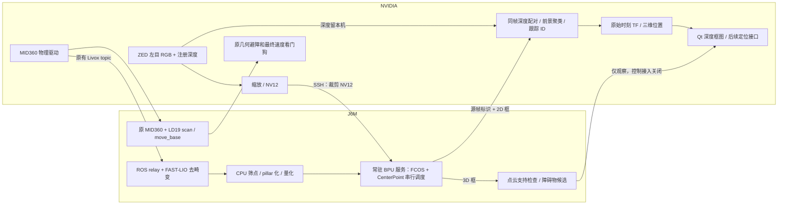

# 双机感知接入记录（2026-09-06）

本轮在独立候选版实施，原工作区和旧 BPU 实验未修改。先完成 GitHub、本地备份，再修改代码。
主运动配置仍为 `MOTION_ENABLED=true`、`FOD_MOTION_ENABLED=false`、最终线速上限 `1.60`；
保留已有授权标记。本轮未启动完整导航、未发送初始位姿、目标或速度指令。

## 可回退版本

- 修改前提交：`e0cbf761d6920e7cc680830115ec0cf6ec28186d`。
- GitHub 分支：[backup/optimized-20260906-before-dual-perception](https://github.com/Doribelove/autolabor-robot-nav/tree/backup/optimized-20260906-before-dual-perception)。
- 标签：`before-dual-perception-20260906`；远端分支和标签已核对。
- 本地：`runtime/backups/before_dual_perception_20260906/`，包括独立解压副本 `project/`、
  `project_before.tar.gz`、`source_history.bundle`、配置、授权标记副本、J6M 旧版本记录。
- 解压后逐项核对 **2531 个普通文件 SHA256，无差异**，另检查符号链接；bundle 已通过 `git bundle verify`。
- 归档 SHA256：`bcb1e88d674ffcd082fe374a0ec4a477b04772da1024e2ccf2908be0bccb1246`。
- bundle SHA256：`ead81489262f8a77d296050642108f035e361f7a9ebba34696e44cb9bb8cf3ac`。
- GitHub 只保存源码和可公开配置，模型、私有配置、运行数据、现场图像保留本地；不能只凭 Git 分支恢复私有配置。
- 修改前 J6M `current` 为 `20260905_160700`，已保留该 release；本地备份中的清扫中断恢复修复当时尚未部署。

## 两条链路和机器职责



点云整理、体素化、输出解量化和后处理仍是 **CPU 工作**，神经网络图在 **J6M BPU** 上执行。
ZED SDK、深度计算仍使用 NVIDIA。没有跨机发送 ZED 完整深度图或视觉点云。
两个模型常驻于同一私有服务，使用一个推理互斥锁、最多两个连接，无无限请求队列；
预算 FCOS ≤30 Hz、CenterPoint ≤5 Hz，当前 FCOS 客户端目标 15 Hz。

正式五材质/垃圾模型后端继续保留。参考 FCOS 是 COCO 80 类，CenterPoint 是 nuScenes 10 类，
二者都不等于已完成垃圾专用模型迁移，本轮不能宣称已释放原正式推理链的全部 GPU 资源。

## 安装几何

用户已确认：参考点是 **ZED 左目中心**，在 MID360 前方 `0.42 m`、右侧 `0.14 m`、等高；
光轴相对水平向下 `41°`，朝向车头，无左右偏转、侧倾。
ROS 约定为 x 前、y 左、z 上，因此 MID360 → 左目平移是 `[0.42,-0.14,0] m`。
当前 MID360 在 base_link 的位置是 `[0.20,0,1.00] m`，左目为 `[0.62,-0.14,1.00] m`。

唯一测量配置：`src/application/autolabor_bpu_perception/config/zed_mount.yaml`。
`scripts/zed_mount_args.py` 根据仓库 ZED2 URDF 的内部 `+0.05 rad` 倾斜、`+0.015 m` 高度、
左目 `[-0.01,+0.06,0] m` 偏移反算安装基座参数：

```text
cam_pos = [0.618284305280, -0.200000000000, 0.981641074585] m
cam_rpy = [0, 0.665584993318, 0] rad
```

不能把左目坐标直接当安装基座坐标，也不能直接把 `cam_pitch` 设为 41°。
正常 `nvidia_ui.sh` 相机启动入口已传递反算结果。实际传感器测试中 TF 左目坐标与测量值一致。
FCOS 发布三维位置前还核对实际相机 TF 与测量配置；不一致时保留二维识别，拒绝三维定位。

## 数据接口与失效行为

| topic | 位置/用途 |
|---|---|
| `/perception/fcos/objects` | 检测类别、置信度、原图框、跟踪 ID、深度、深度离散度、样本数、三维位置 |
| `/perception/fcos/status` | 帧龄、推理/传输/深度融合耗时、丢帧计数 |
| `/fod/bpu_preview/image` | 同一源帧上的类别、ID、Z 深度，供现有 Qt 显示 |
| `/perception/centerpoint/objects` | 有原始点云支持的参考 3D 检测；速度无效 |
| `/perception/centerpoint/markers` | RViz 候选框，短时寿命 |
| `/perception/centerpoint/obstacles_candidate` | 经过源时刻 TF、置信度和两次观测确认的候选多边形 |

- `header.stamp` 保留原始传感器采集时间；`header.frame_id` 是 **全部三维坐标**所在坐标系，
  `source_frame` 保留传感器帧。消费者必须检查 `valid`、`calibrated` 和每个目标的 `position_valid`。
- `bbox` 始终是原始 RGB 图像像素坐标。`depth_m` 是相机光轴 Z 深度，并非车体欧氏距离。
- 深度和 CameraInfo 必须同光学帧、与 RGB 时间差 ≤20 ms、分辨率匹配；支持 32FC1 米及 16UC1 毫米。
- 深度使用检测区域中的连通前景聚类，拒绝无效/稀疏/无法与平面区分的深度；采样区域限宽以控制耗时。
  三维点是所选深度簇的代表点，未声称是垃圾抓取点或地面接触点。
- 有源时刻 `map -> base_link` 才输出 map 坐标，否则明确输出 base_link；不做单位 TF 回退。
- 输入和融合输出各一个最新帧槽；旧结果不会贴到新图上。发布前再次检查 ≤0.35 s 帧龄。
- 无新鲜输入时发布无效空结果，候选适配器清空自身输出；重复发布同一帧不延长源数据寿命。
- ID 在一个 `session_id` 内有效，重启后不能把相同整数 ID 当成同一物体。消失目标不作为当前结果继续发布。
- 两个参考模型均 `motion_eligible=false`，不向自动捡拾发送指令。
- SSH 连接仅传固定格式张量/JSON；校验大小、模型 SHA、序号、源时间，无远程代码执行型反序列化。
- 本轮修正循环 TCP 小包等待，FCOS 推理与深度融合采用两个有界阶段，Qt 隐藏不停止定位计算。

## CenterPoint 仍需完成的验证

使用 [OpenExplorer 官方 HBM](https://huggingface.co/OpenExplorer/centerpoint_pointpillar)，
固定 revision `8fef9fb903ec963bb861cf5c3dbec80124e33074`，模型 SHA256
`7a12188054b4f5a05c112dd6d8611436d84cda3e060e11f72d1f1e739040593c`。
输入布局在实板核对为 features S8 `[1,5,20,40000]`、coors S32 `[40000,4]`；
输出为 36 个分支，逐项校验形状、步长、量化尺度后再使用。

前处理参考[官方 J6 HEAL 说明](https://developer.horizon.auto/blog/14088)及
[官方点云前处理文档](https://doc.oe.horizon.auto/3.8.1/guide/ucp/plugin/dsp_develop/dsp_sample/centerpoint_pointpillar.html)。
生产输入选择 J6M 本机 FAST-LIO 的 `/cloud_registered_body`，按固定 LiDAR/IMU 外参恢复 LiDAR 坐标，
筛除车身、远距和无效点。当前使用单扫、t=0，没有捏造九扫历史或速度有效性。

本轮尚未拿到同一 HBM 的官方黄金输入/输出，后处理采用明确的候选解码和类别内中心抑制，
没有声称与 HEAL 官方后处理精度等价。nuScenes 与室内 MID360 的扫描形式、线束密度、反射强度、
遮挡和类别分布不同，需要实录数据、人工标注及漏检/误检/距离误差测试。

检查还发现现有 TEB 自定义障碍物入口会长期保留最后一帧，并在 TF 失败时按单位变换处理。
本轮没有扩大修改控制器范围，因此 **导航接入即使被设置为 true 也会拒绝启动**。
原 MID360/LD19 几何避障、定位门和速度看门狗继续负责运动边界。
必须先修复并验证 TEB 的源时间/单调时钟寿命与 TF 失效处理，再评估是否接入学习型候选；
仅提高检测阈值不能替代这一步。

## 构建、部署和使用

新增 ROS 包 `autolabor_bpu_perception`；J6M 部署同步路径和 catkin 白名单已加入该包，
消息在两端分别构建。MD5 实测一致：

```text
DetectedObjects  0b9de08adc8c36975207ce885b233461
DetectedObject   8ab8111325554f9412d67ca1cb2a64dc
```

当前 J6M ROS release：`20260906_152402`。本轮部署也包含备份前本地已有、当时未部署的清扫恢复修复。
新原生 BPU 服务位于 `/map/robot_j6m_optimized_20260905/bpu_perception_20260906`，
使用旧私有实验的固定库和 FCOS HBM，旧目录只读复用。未修改系统服务、驱动或固件。

代码入口：

```bash
./scripts/optimized.sh build
./scripts/optimized.sh check --static
# 在停止相关栈后部署两套独立产物：
./scripts/optimized.sh deploy
./scripts/optimized.sh run scripts/deploy_perception_bpu.sh
```

候选本地及已同步 J6M 配置新增 `BPU_PERCEPTION_ENABLED=true`。下次按项目统一入口正常启动时，
NVIDIA UI 生命周期启动 `scripts/perception_companion.py`，后者启动常驻 BPU、NVIDIA FCOS RGB-D 节点、
J6M 已安装的 CenterPoint ROS 节点。不会运行旧预览桥；若同一 topic 已有发布者则拒绝抢占。
现有旧桥运行时必须先用旧桥自己的停止入口退出。

伴随链路不启动导航、不发送目标。远程 ROS 客户端需要持续 SSH 心跳，断链/退出后按其进程组归属停止；
主栈按原统一生命周期停止。独立启动的原生 BPU 服务可用其 `service_manager.py stop` 退出。
没有十分钟到期逻辑。

独立测试入口 `experiments/dual_perception_20260906/tools/rgbd_test.py` 支持
`--centerpoint-load`（原生合成压力）、`--replay`（合成 ROS 点云）、`--mid360`（真实传感器）和 `--qt`。
这些测试使用私有 master 11571，不包含 CAN、move_base、FOD 仲裁。
有 Qt 时会登记目标发布接口，登记不等于发送目标；需要看实际消息计数。

最终测试数据和停止状态见本文件末尾的验收记录。

## 验收记录与限制

本机构建通过；相关 Python 测试和现有工作区汇总 **997 项、0 失败/错误**；新增 shell 语法、
`git diff --check` 和本地静态健康检查通过。J6M 原生构建、版本化安装、静态健康检查及消息 MD5 核对通过。
原生 CenterPoint 库最终 SHA256：`957ca0c6ca058c77c3f52f99b2877d637f331ef5d226856d18fff38d1ae47796`。
最后只读检查：NVIDIA/J6M 本轮感知、相机、Qt、ROS 测试进程均为空，私有 BPU ready=false；
两个导航服务 inactive，候选 chroot 测试挂载已退出。配置/授权保留，不声称当前运行态已经定位。

| 实测窗口 | 输入/并行条件 | 结果 |
|---|---|---|
| `rgbd_20260906_152135`，60 s | 真实 ZED QUALITY 深度，15 Hz；Qt；CenterPoint 原生合成负载 | FCOS RGB-D **14.06 Hz**，671 帧，平均帧龄 **205.32 ms**，P95 285.76 ms；4574 次有效深度观测；CenterPoint 258 帧、无错误、平均 BPU 9.88 ms |
| `rgbd_20260906_152635`，60 s | 真实 ZED QUALITY 深度＋Qt；合成 PointCloud2 经 ROS 到 J6M 已安装节点 | RGB/深度 13.94 Hz，FCOS RGB-D **10.07 Hz**，478 帧，平均帧龄 283.32 ms，P95 330.95 ms；4744 次有效深度观测 |
| 同一 ROS 合成窗口 | 4.98 Hz、10000 点/帧的平面输入 | CenterPoint 有效结果 **263 帧**，处理263/接收263、丢帧0、过期0；最后一帧龄20.74 ms、BPU9.80 ms；平面未检出物体，停输入后尾部结果全部无效、候选为空 |

两个 RGB-D 窗口场景框数量不同，深度处理耗时随目标数量变化；不能只挑最高帧率作为所有场景保证。
“有效深度观测”是跨帧累计次数，不是独立垃圾数量，也不是人工验证正确的检测数量。
这两次均启用了真实深度，区别于历史 `depth=NONE` 的 28.22 Hz RGB-only 结果。

ROS 合成测试观测 `/cmd_vel`、`/cmd_vel_raw`、`/move_base_simple/goal` 的实际消息均为0。
Qt 登记 `/move_base_simple/goal` 是界面初始化行为，未发送目标；没有 CAN 或导航控制节点。
相机、Qt、远端测试节点均按其生命周期退出。测试结果为静止传感器/合成验证，**不是完整导航或实车制动验收**。

**实际阻塞：MID360 网口无载波，192.168.1.112 不可达；J6M 双向网络正常。**
真实 MID360 尝试中 `/cloud_registered_body` 频率为0，不能用合成数据代替真实 MID360 验收。
已向操作员询问供电/网线状态。接通后仍需完成：

1. 真实 MID360 去畸变点云的源帧、时钟、频率和候选框检查。
2. 本场地类别、漏检/误检、距离误差；确认前处理/解码与同一模型黄金样本一致。
3. 同完整 FAST-LIO、定位、导航、现有垃圾模型一起运行时的 CPU/GPU/BPU、带宽和端到端延迟。
4. TEB 旧自定义障碍物寿命及 TF 缺陷修复，再评估控制接入；本版仍拒绝开启该入口。

证据保留于 `experiments/dual_perception_20260906/results/`、`log/dual_perception_*.log`、
`validation/dual_perception_*`，均为候选本地资料，不上传现场观测到公开仓库。

## 回退方法（未执行）

1. 使用 `./scripts/optimized.sh stop` 停止候选主栈，停止本轮私有 BPU 服务及测试，确认没有未知进程归属。
2. 保留后续未提交工作后，切换到 `backup/optimized-20260906-before-dual-perception`。
   用本地备份中的 `dual_host.env` 恢复同机配置，再按隔离入口重新构建。不要改动原项目目录。
3. J6M 停止状态下运行候选 `dual_host/bin/rollback.sh 20260905_160700`，核对 `current`。
4. 相机、地图、时钟和启动仍按原流程；不能从备份自动发送旧目标或猜测初始位姿。

也可以从只读留存的 `project/` 或 tar 另建独立恢复副本。归档不包括可重建的 build/devel/install、
运行时日志；本地配置、模型、地图、实验资料已保存，Git bundle 用于无网络源码历史恢复。
