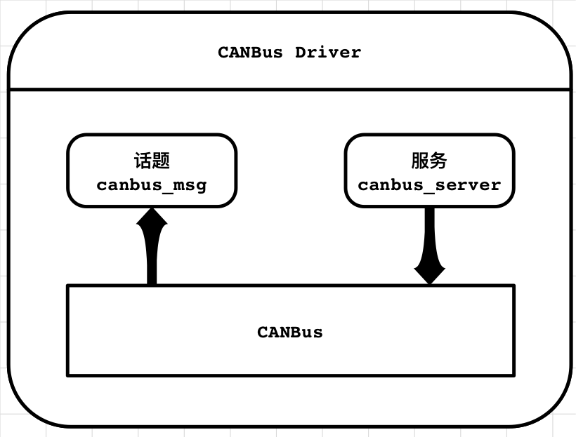
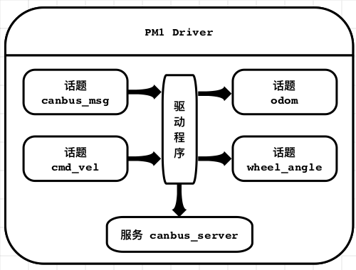

# Autolabor M2 ROS 驱动模块

##  1. 介绍
Autolabor ROS驱动模块包含**CANBus驱动**和**Autolabor M2底盘驱动**，其主要功能包括与Autolabor_CANbus模块通信，并通过线速度和角速度控制Autolabor M2底盘行驶。

#### 特性

- 可直接获取CANBus网络内数据，并通过CAN指令控制车辆
  - 获取动力轮编码器原始数值(角速度)
  - 获取转向轮编码器原始数值(角速度)
  - 分别控制动力轮的转速(角速度)
  - 控制转向轮的绝对转向角度
- 可通过线速度与角速度控制移动底盘，无需单独控制前轮转向
- 提供实时机器人底盘位置信息，方便闭环控制
- 双动力轮电子差速控制，保证机器人在行驶过程中始终满足阿克曼原理
- 根据前轮转向优化车辆运动速度，在保证车辆在行驶精度前提下，确保车辆行驶的流畅性

## 2. 节点

### 2.1 canbus_driver
该节点提供与底层AutoCan的通讯，将CAN网络中的数据进行解析并发布至canbus_msg话题中，并开启canbus_server服务，提供其他节点调用，用以发送CAN指令到CAN网络中。

该节点的结构如图所示：
<div align=left>
	
</div>

#### 2.1.1 订阅话题

无

#### 2.1.2 发布话题
/canbus_msg  ([autolabor_canbus_driver/CanBusMessage](doc/CanBusMessage.md))
~~~
将底层CAN网络中的数据发布在ROS话题中，提供其他节点读取
~~~

#### 2.1.3 服务
/canbus_server  ([autolabor_canbus_driver/CanBusService](doc/CanBusService.md))
~~~
提供其他节点调用，用于往底层CAN网络中发布指令
~~~

#### 2.1.4 参数
~port_name  (str, default: /dev/ttyUSB0)

~~~
CANBus串口端口名
~~~

~baud_rate  (int, default: 115200)
~~~
CANBus串口波特率
~~~

~parse_rate  (int, default: 100)
~~~
数据解析器从串口获取新数据的频率
~~~

### 2.2 pm1_driver

此节点主要用于接收用户发送的速度信息，控制转向轮转动，并根据后轮当前角度结合阿克曼模型优化求解动力轮的转动速度，控制移动底盘进行移动，同时根据动力轮编码器的反馈，输出轮速里程计信息。

该节点结构如下：

<div align=left>
	
</div>

#### 2.2.1 订阅话题

/cmd_vel ([geometry_msgs/Twist](http://docs.ros.org/api/geometry_msgs/html/msg/Twist.html))

```
外部节点发送的速度信息
```

/canbus_msg ([autolabor_canbus_driver/CanBusMessage](doc/CanBusMessage.md))

```
由canbus_driver发送的底层CANBus消息，其中包含转向轮当前绝对编码器以及动力轮的编码器信息
```

#### 2.2.2 发布话题

/odom ([nav_msgs/Odometry](http://docs.ros.org/api/nav_msgs/html/msg/Odometry.html))

```
根据动力轮以及转向轮的编码器信息，依据车辆运动模型，计算出的轮速里程计信息
```

/wheel_angle ([std_msgs/Float64](http://docs.ros.org/api/std_msgs/html/msg/Float64.html))

```
前阿克曼转向轮实时绝对转角，单位rad
```

/left_wheel_vel ([std_msgs/Float64](http://docs.ros.org/api/std_msgs/html/msg/Float64.html))

```
左轮转速，单位m/s。如果需要获得编码器读取的原始转速，只需要将轮速除以车轮半径0.16m即可。
```

/right_wheel_vel ([std_msgs/Float64](http://docs.ros.org/api/std_msgs/html/msg/Float64.html))

```
右轮转速，单位m/s。如果需要获得编码器读取的原始转速，只需要将轮速除以车轮半径0.16m即可。
```

#### 2.2.3 服务

/reset_odom ([std_srvs::Empty](http://docs.ros.org/api/std_srvs/html/srv/Empty.html))

~~~
里程计清零，将里程计的原点放置在执行指令的位置
~~~

#### 2.2.4 参数

~odom_frame (str, default: odom)

```
里程计坐标系名称
```

~base_frame (str, default: base_link)

```
移动底盘坐标系名称
```

~poller_rate_hz (int, default: 20)

```
查询底盘参数的频率，单位 Hz
```

~publish_tf (bool, default: true)

```
设置是否发布odom->base_link的TF转换
```

#### 2.2.5 TF转换信息

odom -> base_link

```
提供车体坐标系与里程计坐标系间转换关系
```

## 3 ROS使用说明

### 3.1 底盘连接

将M2的串口线插入笔记本电脑或工控机，打开底盘电源和急停开关

打开Terminal输入

```
ll /dev/ttyUSB*
```
查看是否有设备列表，如果没有设备，请检查底盘与电脑的连接情况，如果设备多于一个，请通过拔插其他传感器设备，确定底盘的对应的设备节点名，假设节点名为 /dev/ttyUSB0。

### 3.2 源码编译与执行

下载源码

```
mkdir ~/github_ws
cd ~/github_ws
git clone http://git.autolabor.com.cn/Autolabor/autolabor_m2_ros_driver.git
```
编译源码

```
cd autolabor_m2_ros_driver/
catkin_make
```
加载环境变量

```
source devel/setup.bash
```
修改launch文件参数

```
gedit src/autolabor_canbus_driver/launch/m2_driver.launch
```
定位
```
<param name="port_name" value="/dev/ttyUSB0" />
```
将value值改为之前查看的车底盘的设备节点名，修改后保存并关闭

执行launch文件

```
roslaunch autolabor_canbus_driver m2_driver.launch
```
如果成功执行到这一步，并且没有发现任何错误，则车底层驱动就已经启动完毕，这个时候只要启动相应的控制节点就可以控制车底盘行走了。

### 3.3 控制向前直线行走

打开一个terminal

执行 rostopic list 查看有无/cmd_vel 话题

如果有的话，执行：

```
 rostopic pub -r 10 /cmd_vel geometry_msgs/Twist -- '[1.0,0.0,0.0]' '[0.0,0.0,0]'
```

此时车轮会开始转动，如果想要停止的话，必须在执行命令的terminal中执行Ctrl+C，停止发送。