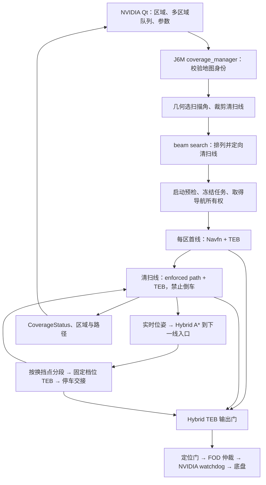

覆盖清扫与 Qt 联合代码审查（2026-09-06）

结论：当前分层架构可以保留，优先修复分段恢复、控制许可和 Qt 跨端请求的身份校验，再修正覆盖面积和参数语义。问题集中在阶段交接与异常分支；没有依据把它们统一归因于 Hybrid A* 搜索速度或硬件算力。

后续修正：本报告第 5 项已经按用户要求落实。Qt 的异常重规划重试等待范围现为
`0–10 s`、默认 `0.5 s`，并直接控制覆盖任务失败后的实际等待；独立的固定
`obstacle_wait_sec=2.0` 配置已经移除。其余审查结论未在该修正中处理。

本次检查了覆盖几何、执行/批次状态机、全局规划插件、Hybrid TEB 输出门、相关 TEB 代码，以及 Qt 的区域编辑、存储、参数同步、规划/开始、暂停/恢复、跳过/取消、状态显示与测试。只增加本审查及离线证据文件，没有改生产源码、配置或授权，没有启动/重启导航、部署或发送实车指令。

**当前实际架构**



- 生产配置为 `hierarchical_hybrid_on_demand=true`、`direct_hybrid_to_final_goal=true`、`hybrid_execute_unsplit_cusps=false`；不预计算整场可执行转场轨迹。
- 几何层是候选角度扫描线裁剪，生产分支先用几何分数选角，再对这一角度的条带执行宽度 128 的时间 beam search。不能称为“所有角度与线序联合求全局最短时间”。见 [当前生产规划入口](/home/slam/robot_j6m_ws_optimized_20260905/src/application/autolabor_coverage/scripts/coverage_manager.py:1913)。
- 首线候选使用静态已知自由路径距离；后续线间连接在排序时用无障碍运动学时间代理，执行前才从实际位姿搜索。普通入场与转场职责不同。
- Qt 使用 `QSettings` 保存 11 项参数，异步同步到后端；单区规划/开始绑定 plan ID，批次开始预生成请求 ID，整批取消有精确 ID 和迟到响应补偿。
- Qt 区域库已有地图目录/摘要隔离、文件锁、写前指纹复核与原子写入；已知区域仅保存多边形，不自动恢复运动。
- 多边形定义待覆盖面积，现有设计允许转场离开多边形并经过地图中的已知自由空间。Qt 明示“未接入 · 仅执行覆盖导航”，没有把刷盘/风机等机构当作已工作。这两点属于产品边界，不能作为代码遗漏误报。

**源码与安装态核对**

只读确认 J6M 候选 `current` 为 `/opt/autolabor/dual_host/releases/20260905_160700/install`。覆盖管理器、几何模块、Hybrid 输出门这三份 Python 文件的本地/安装态 SHA-256 完全一致。未重新构建 Qt，也没有据此声称当前运行进程加载了哪些参数。

Qt 候选专属 QSettings 与 J6M 安装态 YAML 的持久值一致，但它们与源码出厂默认值不同：

| 参数 | 本地 coverage.yaml 默认值 | Qt 保存值 / J6M 安装态 |
| --- | ---: | ---: |
| 清扫宽度 | 1.00 m | 1.20 m |
| 重叠率 | 15% | 5% |
| 条带中心距 | 0.85 m | 1.14 m |
| 前进 / 倒车速度 | 0.80 / 0.30 m/s | 1.00 / 0.30 m/s |
| 最大角速度 | 0.60 rad/s | 0.40 rad/s |
| 角加速度 | 0.50 rad/s² | 0.70 rad/s² |
| 换向附加时间 | 0.50 s | 1.00 s |
| “异常重规划重试间隔” | 1.00 s | 1.00 s |

因此不能仅照历史架构文档中的 1.30/0.80 m/s 等数值分析当前行为。当前五项专用转场速度/加速度覆盖均为 0，实际采用任务参数继承机制；见 [参数继承实现](/home/slam/robot_j6m_ws_optimized_20260905/src/application/autolabor_coverage/scripts/coverage_manager.py:6394)。

**优先修复的问题**

1. **P1：扫掠中断后，恢复目标错误地回到整条线的原入口。**

   **后续状态（2026-09-06）：候选源码已修正并新增中断续扫回归测试，尚未部署到 J6M。**
   以下保留审查时的问题证据；修正行为及验证边界见
   [清扫中断恢复修正](COVERAGE_SWEEP_RESUME_20260906.md)。

   [action 终态处理](/home/slam/robot_j6m_ws_optimized_20260905/src/application/autolabor_coverage/scripts/coverage_manager.py:7691) 先处理 ABORTED/REJECTED 并返回 blocked，位于后面的有向完成观察不会再执行；外层重试重新调用 [入口检查](/home/slam/robot_j6m_ws_optimized_20260905/src/application/autolabor_coverage/scripts/coverage_manager.py:7971)，恢复目标固定为 [sweep.start](/home/slam/robot_j6m_ws_optimized_20260905/src/application/autolabor_coverage/scripts/coverage_manager.py:2952)。

   离线同一条 9 m 直线、相同连续位姿及停车输入：没有 ABORTED 时两次终点样本得到 succeeded；在最后一次观察前插入 ABORTED 时得到 blocked，下一次要求恢复到 x=0，距离 9.04 m。该方向也与项目既有行人阻挡记录吻合。

   Qt 的 [恢复按钮](/home/slam/robot_j6m_ws_optimized_20260905/src/application/autolabor_operator_gui/src/main_window.cpp:7571) 只调用后端解除暂停，不会为它生成剩余扫掠，因此 Qt 没有补上这一缺口。

   建议将可信扫掠进度绑定到 swath，而不是单次 action；异常终态先保留进度，在定位、路径历史和实测停车仍可信时复核完成，否则恢复剩余未覆盖部分。不能直接把所有 ABORTED 当成功，也不能靠扩大 4 m 恢复包络解决。

2. **P1：Hybrid 异常路径被拒绝后，输出门会进入普通转发分支。**

   [路径解析失败](/home/slam/robot_j6m_ws_optimized_20260905/src/application/autolabor_coverage/scripts/hybrid_teb_command_mux.py:256) 调用 disarm，将 hybrid_active 设为 false；随后 [_update 的普通分支](/home/slam/robot_j6m_ws_optimized_20260905/src/application/autolabor_coverage/scripts/hybrid_teb_command_mux.py:370) 只检查 TEB 指令新鲜度。

   向本地替身先输入有效 Hybrid 路径，再输入含前后混合边的异常 Hybrid 路径，许可保持 false；三次定时回调得到线速度 [0, 0, 0.3] m/s。所有输出只写入内存 Sink，未发布 ROS。

   建议将“明确切回普通导航”和“Hybrid 校验失败”拆成不同状态。后者锁存零速，直到同一任务的新有效路径、对应许可和新指令都齐备；空路径、非法 frame/档位等也纳入此门。

3. **P1：Qt 的“跳过当前区域”没有把操作者确认的区域身份发送给后端。**

   Qt 在确认前后检查了区域 ID/索引，这是已有保护；但 [异步发送处](/home/slam/robot_j6m_ws_optimized_20260905/src/application/autolabor_operator_gui/src/main_window.cpp:7441) 使用无请求字段的 Trigger。后端 [_skip_current_service](/home/slam/robot_j6m_ws_optimized_20260905/src/application/autolabor_coverage/scripts/coverage_manager.py:5364) 只操作收到请求时的当前区域。

   离线模拟操作者确认 A、请求抵达时后端已切换到 B，结果仍 accepted=true，并对 B 记录 skip/cancel。Qt 回包时检查代际只能防止旧 UI 更新，无法撤回已发生的后端操作。

   建议请求携带 batch_id、region_id、region_generation、request_id，由后端在锁内匹配后执行。暂停/恢复也应携带任务身份；当前 [SetBool 调用](/home/slam/robot_j6m_ws_optimized_20260905/src/application/autolabor_operator_gui/src/main_window.cpp:7611) 仅发送一个布尔量。消息/服务变更应同步两端与 Qt。标准协议字段也核对了 [ROS Trigger 定义](https://raw.githubusercontent.com/ros/ros_comm_msgs/noetic-devel/std_srvs/srv/Trigger.srv) 与 [SetBool 定义](https://raw.githubusercontent.com/ros/ros_comm_msgs/noetic-devel/std_srvs/srv/SetBool.srv)。

4. **P1：规划“可覆盖面积”可能掩盖真实漏扫，Qt 原样显示该数字。**

   [规划面积计算](/home/slam/robot_j6m_ws_optimized_20260905/src/application/autolabor_coverage/src/autolabor_coverage/coverage_geometry.py:699) 使用 min(区域面积, 总线长×宽度)，没有对重叠去重；[末行生成](/home/slam/robot_j6m_ws_optimized_20260905/src/application/autolabor_coverage/src/autolabor_coverage/coverage_geometry.py:625) 仅在剩余行距大于 0.55×spacing 时追加末行，较窄的未覆盖边带可能留下。Qt 的 [规划结果提示](/home/slam/robot_j6m_ws_optimized_20260905/src/application/autolabor_operator_gui/src/main_window.cpp:6722) 以及 [面积栏](/home/slam/robot_j6m_ws_optimized_20260905/src/application/autolabor_operator_gui/src/main_window.cpp:6086) 直接使用后端值。

   在没有障碍、周围也有充分自由空间的 0.1 m 栅格上调用当前生产使用的几何选角分支：

   | 参数与区域 | 后端可覆盖 / 不可覆盖 | 同模块栅格扫掠并集 |
   | --- | --- | --- |
   | 默认 1.0 m / 15%，20×3 m | 60 / 0 m² | 54 m²，缺 6 m² |
   | 当前保存 1.2 m / 5%，20×3.6 m | 72 / 0 m² | 70 m²，缺 2 m² |
   | 对照：1.2 m / 5%，20×3.5 m | 70 / 0 m² | 70 m² |

   这里量化的是“名义清扫宽度的规划栅格并集”，不是实体清洁效果。执行期 covered_cells 已做并集去重，这部分不能误报为重复累加；但分母和规划完整性仍有问题。任务 [COMPLETED 判据](/home/slam/robot_j6m_ws_optimized_20260905/src/application/autolabor_coverage/scripts/coverage_manager.py:8320) 只看分段/阻塞结果，没有剩余面积检查。

   建议规划和执行共用可覆盖目标掩码与扫掠并集，按真实未覆盖格生成补扫条带；区分障碍、不可通行、短碎片和暂时未扫。Qt 显示边带/缺口图层，并将“路线执行完成”与“覆盖率达标”分开。

5. **P2（已修正）：Qt 的“异常重规划重试间隔”原先没有控制生产分支的实际退避。**

   [Qt 控件说明](/home/slam/robot_j6m_ws_optimized_20260905/src/application/autolabor_operator_gui/src/main_window.cpp:2631) 允许 1–10 s 并宣称控制失败重试间隔。字段确实同步、保存并发送，但生产 [makeHybridPlan 分支](/home/slam/robot_j6m_ws_optimized_20260905/src/application/autolabor_coverage/src/coverage_global_planner.cpp:616) 在使用它做冷却之前已经返回；按需 precompute 服务只校验其范围。管理器当前的 [异常退避](/home/slam/robot_j6m_ws_optimized_20260905/src/application/autolabor_coverage/scripts/coverage_manager.py:8181) 使用独立 obstacle_wait_sec=2.0。

   原逻辑中“已同步”并不证明这个旋钮改变了事件模式的重试等待。后续修正已让管理器明确消费任务冻结值，范围为 `0–10 s`、默认 `0.5 s`；`0 s` 会在旧 action 确认终态后立即重试。前进/倒车控件的继承语义仍按当前 0 覆盖值执行。

6. **P2：最后一次补扫机会会被入口恢复提前耗尽。**

   [最终重试循环](/home/slam/robot_j6m_ws_optimized_20260905/src/application/autolabor_coverage/scripts/coverage_manager.py:8278) 在恢复入口前增加 attempt；恢复成功后 continue。默认 final_retry_count=1 时，循环立即结束，不会真正执行补扫。

   离线结果：原始扫掠一次 blocked，入口恢复一次 succeeded，恢复后的扫掠调用数为 0，最终 COMPLETED_PARTIAL。建议将入口恢复次数和实际补扫次数分别计数，分别保留有界重试。

7. **高优先级协议缺口：Hybrid 安全许可没有绑定路径代际。**

   插件发布 [std_msgs/Bool](/home/slam/robot_j6m_ws_optimized_20260905/src/application/autolabor_coverage/src/coverage_global_planner.cpp:237)，mux [只记录值与接收时刻](/home/slam/robot_j6m_ws_optimized_20260905/src/application/autolabor_coverage/scripts/hybrid_teb_command_mux.py:283)。新路径确实会清空旧许可，不能误报“完全没有清空”；但旧计算结果若在新路径之后抵达，消息本身无法辨认。标准 [Bool 定义](https://raw.githubusercontent.com/ros/std_msgs/noetic-devel/msg/Bool.msg) 仅有 data。

   消息顺序注入显示：代际 2 已清空许可后，再送入代表代际 1 的 Bool(true)，mux 会认可它并转发测试速度。插件的计算在获取路径快照后进行，发布许可前没有复核当前代际，因此有实际代码上的并发窗口。不过本次没有运行 ROS 线程调度实验，也没有实车发生概率证据。

   建议许可包含 plan_id、segment_index、path_generation、expected_gear、检查时间/有效期；发布前复核当前代际，接收端必须精确匹配。Qt 可以显示“等待当前路径许可”，不能靠界面代际过滤代替控制链校验。

**后续优化，按收益推进**

- 先保留不可变的任务结果，再清理实时图层。目前 [终态清理](/home/slam/robot_j6m_ws_optimized_20260905/src/application/autolabor_coverage/scripts/coverage_manager.py:8447) 会清空 plan 和 covered_cells，Qt 又使用实时字段显示面积；结束后缺少最终面积、漏扫分布和整批汇总。清理旧可执行路径是正确行为，结果存档应独立保存，不携带自动恢复执行权。
- 在同等真实覆盖率下，对少量候选角度再做时间排序，连接时间建立缓存。当前先选角后排线，beam 内重复计算相同端点/方向的代价。后续转场代理也不含墙体拓扑，建议先加静态通行代价/连通性筛选，再保持实时 Hybrid 搜索，不恢复高成本的任务级轨迹预计算。
- 点栅格连通不等于整车可通。当前 reachable_free_cells 是点的四连通，清扫线自身再做 footprint 检查；中间连接穿越窄门是否可行仍待执行时确认。可用车辆净空图预先标注这类候选和区域，减少“预览成功、入场一直失败”。
- 对规划增加总预算、取消检查和可观测的阶段进度。Qt 服务调用放到后台避免直接阻塞界面，但几何/beam 长循环没有完整取消预算；代际校验能拒绝迟到提交，不能立即停止旧计算。先测区域面积/条带数量与规划 P50/P95、取消响应时间，再决定进程化或 C++ 化。
- 实走路径在 [5 Hz 追踪回调](/home/slam/robot_j6m_ws_optimized_20260905/src/application/autolabor_coverage/scripts/coverage_manager.py:8453) 持续追加、深拷贝和发布完整 Path。长任务可分块记录、显示抽稀、限制显示窗口；覆盖格并集与验收精度独立保留。本次没有做长任务性能测量，不能据此断言现场 Qt 卡顿原因。
- 拆分 8674 行 coverage_manager 与 8584 行 main_window：将任务/区域队列、控制权、入口/完成几何、参数事务分别组织；Qt 已独立出的区域存储模块应保留，再分离 CoverageController、状态显示与异步服务层。
- Qt 在区域确认和开始弹窗中说明“该范围是覆盖需求，转场可外出”，同时区分条带、车体轮廓、允许通行区。若业务需要禁止越界，需另建规划与控制一致执行的约束，不能把目前多边形默认为围栏。

**验证与证据边界**

现有测试实际重跑 246 项，全部通过：覆盖 Python 160、Qt Python 52、Hybrid C++ 7、Qt 区域库 C++ 11、TEB C++ 16。C++ 使用候选目录已有构建产物；Qt 的 52 项 Python 主要是源码契约检查，11 项 C++ 是存储行为测试，不能称为实际窗口点击或端到端联调通过。现有 mux Python 仅 3 项辅助函数测试，没有覆盖本文的回调/定时分支。测试通过与上述缺口同时成立。

新增离线探针直接调用未修改的生产 Python 方法，用本地位姿、action、服务和 Publisher 替身观察；没有初始化 ROS 节点。复现步骤：

```bash
scripts/optimized.sh run bash -c '
source scripts/setup_env.sh
export ROS_MASTER_URI=http://127.0.0.1:11997
python3 validation/coverage_qt_review_20260906/reproduce.py
'
```

- [离线探针](/home/slam/robot_j6m_ws_optimized_20260905/validation/coverage_qt_review_20260906/reproduce.py)
- [复现原始结果](/home/slam/robot_j6m_ws_optimized_20260905/validation/coverage_qt_review_20260906/reproduction_results.json)
- [246 项既有测试输出](/home/slam/robot_j6m_ws_optimized_20260905/validation/coverage_qt_review_20260906/existing_tests.log)
- [源码/安装态身份与参数记录](/home/slam/robot_j6m_ws_optimized_20260905/validation/coverage_qt_review_20260906/observations.json)
- [只读取得的 J6M 配置快照](/home/slam/robot_j6m_ws_optimized_20260905/validation/coverage_qt_review_20260906/j6m_installed_coverage.yaml)

原工程没有改动；本候选副本没有 .git 元数据，不能生成 Git 工作树差异。J6M 无部署变更，current 仍是 20260905_160700；主运动配置 true、FOD=false、1.60 m/s 最终上限和既有授权均未修改。本审查不提供新的 LOCALIZED、watchdog 运行态或实车清扫/制动验收结论。
