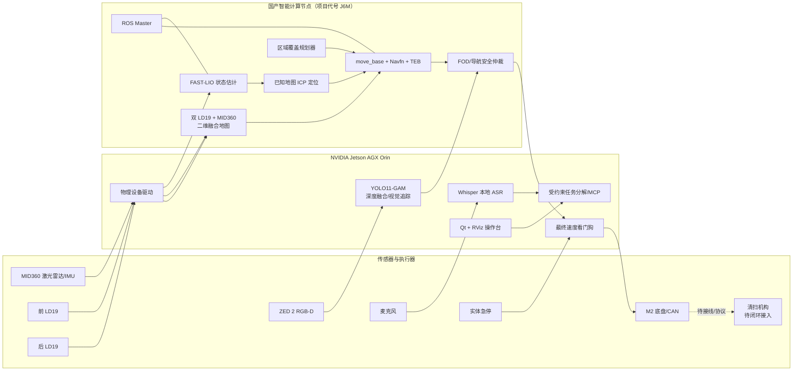
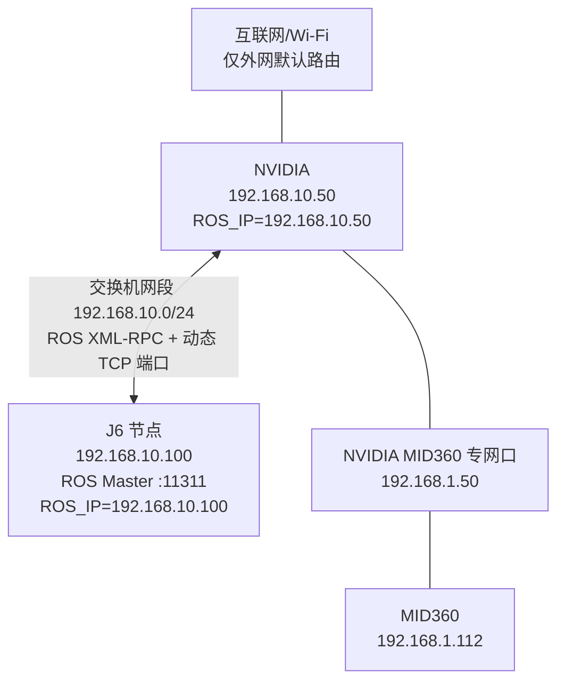
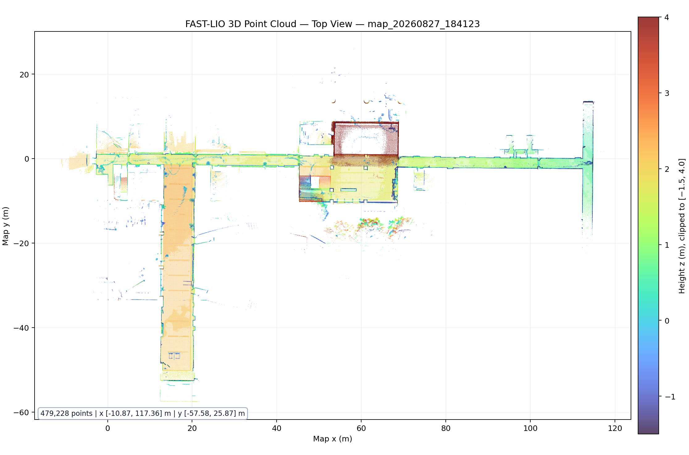
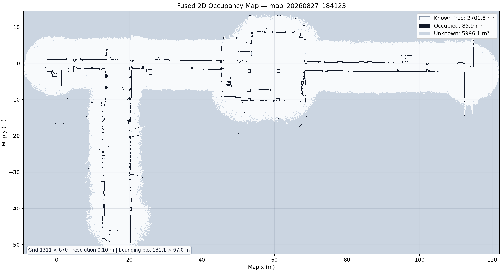
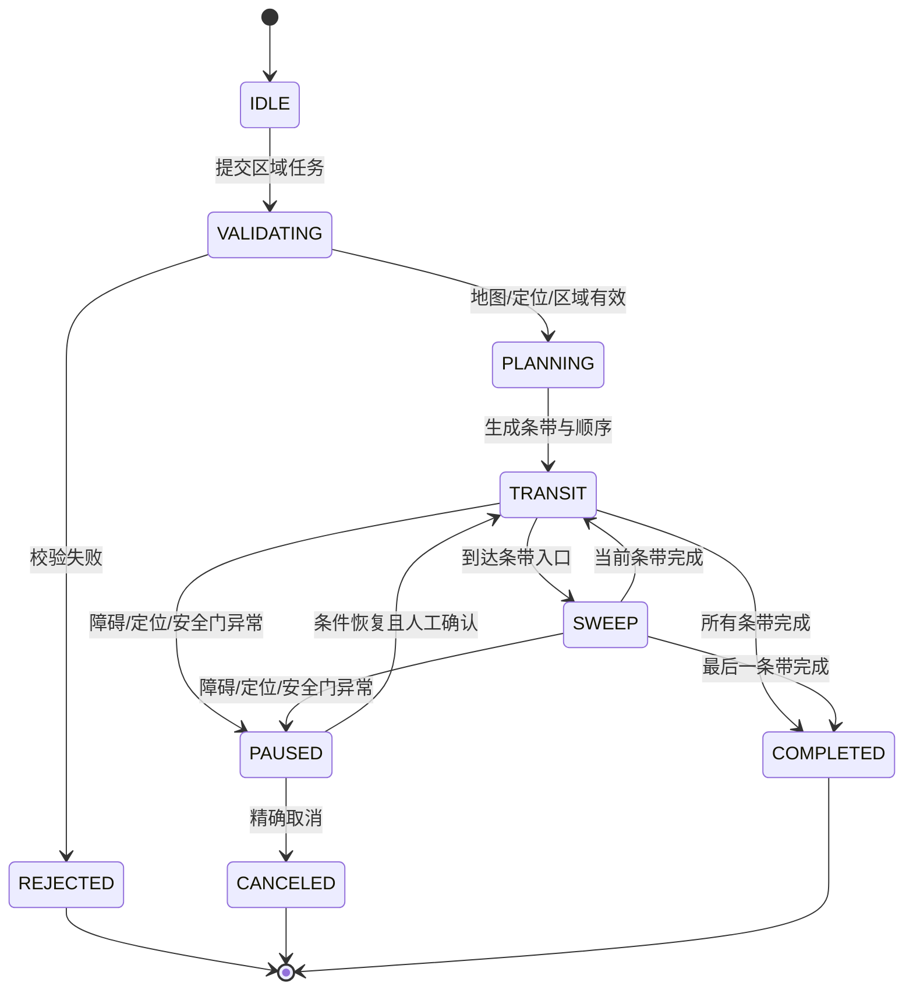
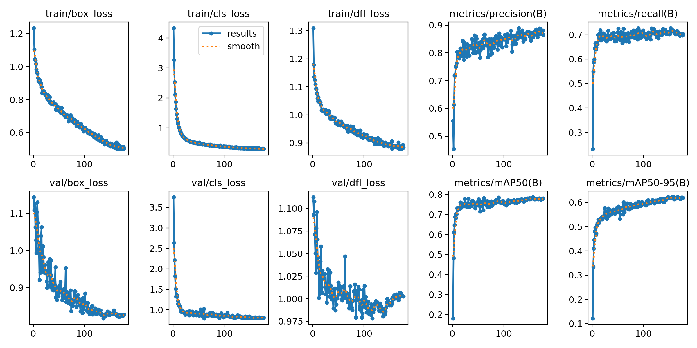
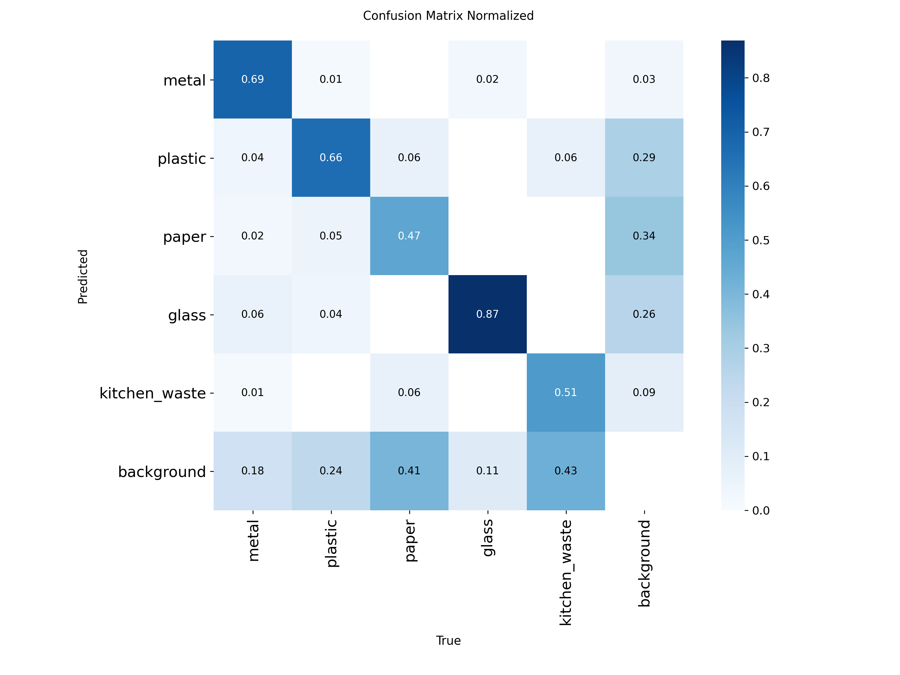
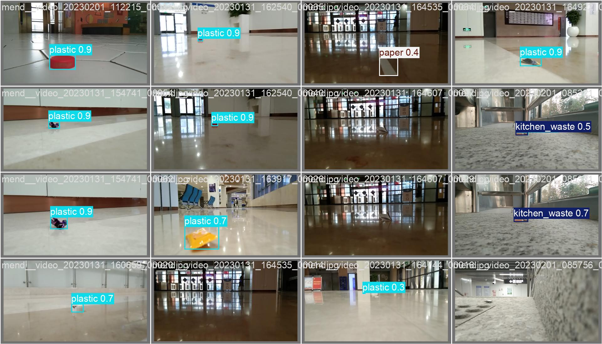
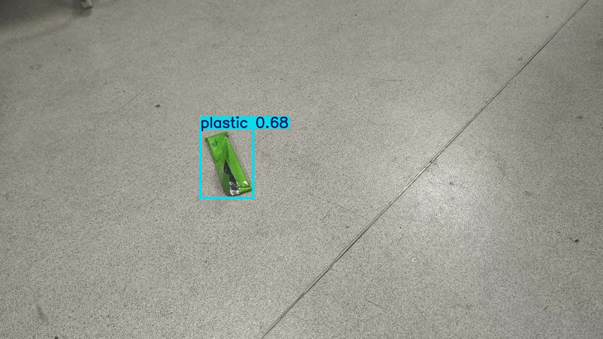

# 面向智慧环卫场景的国产系统无人清扫车关键技术攻关

## 初赛技术方案报告（第一版）

| 项目 | 内容 |
|---|---|
| 赛题名称 | 面向智慧环卫场景的国产系统无人清扫车关键技术攻关 |
| 赛题编号 | DG-202604 |
| 赛事 | 2026 年度中国青年科技创新“揭榜挂帅”擂台赛 |
| 项目名称 | 基于国产智能计算平台的室内无人清扫车系统 |
| 参赛单位 | **[待填写]** |
| 团队名称 | **[待填写]** |
| 项目负责人 | **[待填写]** |
| 指导教师 | **[待填写]** |
| 联系方式 | **[待填写]** |
| 文档版本 | V1.0 |
| 编制日期 | 2026 年 8 月 29 日 |

> **文档定位**：本文件是初赛技术报告的第一版 Markdown 母稿，用于统一技术叙事、证据口径和正式测试计划。赛事最终要求提交 20～50 页 PDF；完成文中的待办项并替换占位图后，再由本文件排版导出 PDF。

---

## 修订记录

| 版本 | 日期 | 修订内容 | 编制人 |
|---|---|---|---|
| V1.0 | 2026-08-29 | 建立完整报告框架；纳入当前软件、地图、数据集、离线评测和低速实车测试证据；明确未达标项与正式测试方案 | **[待填写]** |

## 提交前必须处理的编辑项

1. 补齐参赛单位、团队、负责人、指导教师、联系人和成员分工。
2. 拍摄并插入整车、清扫机构、垃圾箱、传感器布置、急停按钮和国产计算平台铭牌照片。
3. 以实物铭牌确认国产计算平台的准确商品型号。本项目内部沿用“J6M”代号，但当前系统只读设备树曾显示“J6E MatrixB Development Board”，正式稿不能在未核验时填写芯片型号或算力。
4. 向组委会确认“至少两种人机交互方式”的认定口径。本系统已有本地可视化界面、文字指令和语音指令，但尚无 APP；赛题列举的脑机、语音、APP是否为封闭选项需要确认。
5. 向组委会确认材料中“机械臂”“抓取”的适用性。当前车辆采用清扫/近距追踪方案，没有机械臂抓取机构。
6. 用正式测试结果替换所有“待测”“未满足”和临时证据；任何指标只有达到本文定义的 E5 证据等级后，才可在摘要和结论中写“达到赛题要求”。

## 证据等级与写作口径

为避免把设计值、代码存在或单次演示误写成竞赛达标结论，本文统一采用以下证据等级。

| 等级 | 含义 | 可支持的表述 |
|---|---|---|
| E0 | 需求、方案或待实现设计 | “计划”“设计为” |
| E1 | 代码审查、静态检查、单元测试或仿真通过 | “已实现并通过软件测试” |
| E2 | 离线数据集、地图、rosbag 或回放验证 | “在指定离线数据上得到……” |
| E3 | 实机上电、真实传感器、零速或只读联调 | “实机链路已连通” |
| E4 | 受控场地中的低速实车功能测试 | “在本次受控测试中完成……” |
| E5 | 有方案、有样本量、有原始记录、可复现的正式指标验收 | “达到赛题指标” |

除非另有说明，本文给出的地图和模型指标属于 E2，2026 年 8 月 24 日覆盖清扫低速测试属于 E4，2026 年 8 月 29 日软件测试属于 E1。当前尚无项目指标达到 E5。

---

## 摘要

面向机场、园区、校园和大型公共建筑等室内外衔接的智慧环卫场景，本项目研制一套以国产智能计算平台承担机器人主控任务、以异构算力节点承担高带宽视觉感知任务的无人清扫车系统。系统基于 ROS 1 Noetic 构建双机协同架构：国产计算节点负责 ROS Master、FAST-LIO 状态估计、已知地图点云配准、二维环境融合、全覆盖任务规划、move_base/TEB 局部规划和安全仲裁；NVIDIA Jetson AGX Orin 节点负责 MID360 物理驱动、前后二维激光雷达、ZED 双目深度相机、YOLO11-GAM 垃圾识别、本地语音识别、Qt/RViz 操作界面、底盘 CAN 网关及最终速度看门狗。

项目已经形成从三维建图、二维融合地图、已知地图定位、区域覆盖规划、动态避障、垃圾识别与深度定位、近距视觉追踪，到文字/语音任务分解和多层安全控制的完整软件链。系统采用“导航控制与视觉控制互斥、控制权显式分配、指令有时效、异常即归零”的失效安全设计，并通过版本化部署保证国产计算节点的软件可追溯和可回滚。

截至 2026 年 8 月 29 日，本地自动化测试累计 769 项，0 错误、0 失败、0 跳过。现有地图集包含 479,228 个三维点，融合二维地图分辨率为 0.10 m；按栅格保守统计，已知自由区域为 2701.8 m²。YOLO11-GAM 在 352 张独立测试图像上的 Precision、Recall、mAP@0.5 和 mAP@0.5:0.95 分别为 72.34%、64.56%、70.25% 和 54.65%，相对同数据上的官方 YOLO11 基线，mAP@0.5 提升 3.89 个百分点，mAP@0.5:0.95 提升 6.19 个百分点。一次受控低速实车覆盖测试记录了 459 个速度样本，最大线速度为 0.300 m/s，并验证了覆盖条带、Navfn 转场、TEB 避障和安全暂停的链路。

上述结果证明了系统原型的完整性和关键技术的可行性，但尚不能证明全部竞赛指标达标。当前地图面积小于 20,000 m²，视觉识别指标低于 95%，清扫执行机构尚未完成闭环接入，垃圾箱容积、清扫宽度、定位精度、清扫效率、避障成功率、急停时间、自然语言解析准确率和长期可靠性仍需按本文测试方案正式测量。第一版报告据此将“已完成的软件能力”与“尚待取得的竞赛证据”分开陈述，并给出初赛提交前的测试和材料闭环计划。

**关键词**：无人清扫车；国产智能计算平台；FAST-LIO；点云定位；全覆盖路径规划；TEB；YOLO11-GAM；多模态交互；失效安全

---

## 1. 项目背景与需求分析

### 1.1 赛题背景

根据[赛事官方赛题页面](https://developer.horizon.auto/competition/848127658035142656)，机场、园区、校园等大面积公共场所的环卫作业具有范围大、重复度高、环境动态变化明显等特点。传统人工清扫存在劳动强度高、覆盖质量难量化、人员排班成本高等问题；现有无人清扫设备则常面临复杂环境适应性不足、多设备协同困难、人机交互门槛较高和国产化核心平台不足等限制。

赛题要求面向智慧环卫场景设计并实现无人清扫车，重点考察全覆盖清扫、垃圾识别与定位、定位建图、动态避障、人机交互、大模型任务分解和安全控制。初赛时间为 2026 年 7 月 1 日至 9 月 15 日，需提交技术方案报告以及 5～10 分钟的原型或仿真演示视频；技术报告最终为 20～50 页图文 PDF。

### 1.2 项目目标

项目目标不是单独验证某一种算法，而是形成一套可在真实车辆上长期运行、可测试、可追溯的完整系统：

- 以国产智能计算节点承担定位、规划、ROS 图管理和安全仲裁等机器人核心任务；
- 构建适用于长走廊、大厅和开放区域的三维/二维地图及已知地图定位能力；
- 将“区域任务”转换为可执行、可暂停、可取消和可恢复的覆盖轨迹；
- 识别并定位地面垃圾，在安全条件满足时完成近距追踪；
- 支持图形界面、文字和语音任务输入，并将自然语言约束为有限、可审计的机器人工具调用；
- 对网络、传感器、定位、控制权和指令新鲜度实行失效安全控制；
- 建立覆盖竞赛评分项的正式测试方法，保证每项结论都能追溯到原始数据。

### 1.3 赛题指标分解与当前状态

下表采用保守口径。“已实现”只表示功能链存在，不等于达到数值指标。

| 赛题要求 | 目标值或功能 | 当前证据 | 等级 | 当前结论 |
|---|---:|---|---:|---|
| 多场景全覆盖清扫 | 自动/定时/定点/区域覆盖 | 已实现地图选区、多区域队列、覆盖规划与导航执行；有一次低速部分路径测试 | E4 | 功能链已形成，完整清扫闭环待测 |
| 垃圾识别与定位 | 识别准确率 ≥95% | 独立测试集 mAP@0.5=70.25%，并已接入 ZED 深度 | E2 | **当前不能判定达标** |
| 垃圾自动清扫 | 识别后自动执行 | 已实现视觉追踪和控制仲裁；主刷、边刷、风机、喷淋未完成闭环接入 | E1/E4 | **未形成物理清扫闭环** |
| 积水与落叶适应 | 水深 ≤1 cm，落叶厚度 ≤3 cm | 尚无实物工况试验 | E0 | **待测** |
| 垃圾箱容积 | ≥40 L | 无经校准量具记录 | E0 | **待测/可能需改造** |
| 清扫效率 | ≥3500 m²/h | 尚无完整区域清扫计时 | E0 | **待测** |
| 定位精度 | ≤50 mm | 已知地图 ICP 定位已实现，但无全站仪/控制点真值试验 | E1 | **待测** |
| 清扫宽度 | ≥600 mm | 无实物测量记录 | E0 | **待测** |
| 建图面积 | ≥20,000 m² | 当前地图边界框 8783.7 m²，已知自由区域 2701.8 m² | E2 | **当前未满足** |
| 动态避障 | 成功率 ≥95%（评分口径） | MID360/双 LD19 融合、TEB 和未知区保护已实现，缺少统计样本 | E1/E4 | **待正式测试** |
| 边界保护 | 防越界/防跌落 | 未知栅格、地图边界和定位状态均参与运动门；专用悬崖传感器待确认 | E1 | 功能实现，实测待补 |
| 紧急制动 | ≤1 s（评分口径） | 急停和多级零速链已实现，缺少同步高速采样 | E1 | **待正式计时** |
| 多模态交互 | 至少两种指定形式 | Qt 图形/文字输入、本地语音输入已实现；APP 未实现 | E1 | **需确认认定口径** |
| 指令识别 | ≥95% | 本地 ASR 和命令解析链已实现，缺少正式语料集 | E1 | **待正式测试** |
| 大模型任务拆解 | 解析准确率按 95%目标验收 | 受约束计划和 15 个 MCP 工具已实现，缺少标注测试集 | E1 | **待正式测试** |
| 新手上手 | ≤3 天 | 界面和统一启停已实现，缺少新手受试记录 | E1 | **待测** |
| 日故障率 | <1% | 缺少连续多日运行记录 | E0 | **待测** |
| 耗材更换 | ≤3 步、无需工具 | 清扫机构尚未定型 | E0 | **待设计/待测** |

> 赛事功能说明中的自然语言解析指标为 95%，评分说明中任务拆解项出现 90%口径。项目统一以更严格的 **95%** 作为内部验收目标。

### 1.4 应用场景

项目优先面向以下场景：

1. 机场航站楼、连廊等长走廊与大厅；
2. 校园教学楼、体育馆和图书馆公共区域；
3. 工业园区、展馆和大型办公建筑；
4. 在完成防水、防尘和边界传感器升级后的半室外园区道路。

第一阶段以结构化室内地面为主，环境中允许出现行人、临时障碍物、反光地面和局部弱纹理区域。积水、厚落叶、坡道、台阶边缘及恶劣天气属于专项验收工况，不能仅凭室内导航结果推断通过。

---

## 2. 系统总体方案

### 2.1 设计原则

系统遵循六项原则：

- **核心控制国产化**：国产智能计算节点承担机器人状态估计、定位、规划和安全仲裁；
- **异构算力分工**：高带宽相机和 CUDA 视觉留在 NVIDIA 节点，避免无意义跨机传输；
- **同图协同、职责固定**：双机加入同一 ROS 图，但节点运行位置由启动入口显式确定；
- **地图、定位、规划解耦**：三维点云、二维导航图和融合障碍图分别服务不同目的；
- **失效安全**：输入失联、定位异常、控制权冲突或指令过期时默认输出零速；
- **可复现交付**：构建、部署、地图、模型、日志和测试结果均有固定身份或哈希。

### 2.2 总体架构



图 2-1 系统功能架构。实线表示当前主要数据或控制链，虚线表示待完成的清扫执行机构闭环。

### 2.3 硬件组成

| 子系统 | 当前硬件 | 主要作用 | 当前状态 |
|---|---|---|---|
| 国产主控 | 地平线征程 6 系列开发平台，项目代号 J6M | ROS Master、定位、建图融合、导航、覆盖规划、安全仲裁 | 已运行；准确型号待铭牌核验 |
| 视觉计算 | NVIDIA Jetson AGX Orin Developer Kit，64 GiB | ZED、CUDA、YOLO11、Qt/RViz、语音和底盘网关 | 已运行 |
| 三维激光 | Livox MID360 | 点云、IMU、FAST-LIO、三维地图和中高障碍补充 | 已接入 |
| 二维激光 | 前/后 LD19 各 1 个 | 近地障碍、二维占据栅格与导航避障 | 已接入 |
| 深度相机 | ZED 2 | RGB、注册深度、垃圾识别和近距追踪 | 已接入 |
| 移动底盘 | Autolabor M2 + USB-CAN | 差速运动执行、里程与底盘状态 | 已接入 |
| 人机输入 | 麦克风、键盘鼠标和本地显示器 | 语音、文本、图形操作 | 已接入 |
| 安全装置 | 实体急停、软件运动门、速度看门狗 | 人工制动和软件失效安全 | 软件链已实现；急停时间待测 |
| 清扫组件 | 主刷/边刷/风机/喷淋/垃圾箱 | 物理清扫与收集 | **未完成闭环接入，规格待确认** |

> 国产平台在正式报告中的型号、芯片规格和算力必须来自实物铭牌、采购资料或厂商正式资料。仅当确认实物确属 Journey 6M 后，才能引用地平线官方公布的 128 TOPS 等参数。

> **[待补图 HW-01｜整车与硬件总览]** 需要 1 张整车左前 45°主视图和 1 张俯视/半俯视标注图。车辆置于干净、光线均匀的场地，完整拍到车体、急停和清扫机构；在标注图中用箭头标出国产计算平台、Jetson、MID360、前后 LD19、ZED 2、麦克风、CAN、垃圾箱、主刷和边刷。横图建议不低于 3840×2160，避免聊天截图、终端窗口和无关人员入镜。建议文件名：`HW-01_vehicle_overview.jpg`、`HW-02_sensor_layout.jpg`。

> **[待补图 HW-03/04｜国产平台身份证据]** 需要“设备在整车中的安装位置”和“铭牌近景”各 1 张；铭牌型号、厂商名称应清晰可读，设备序列号可在报告版中打码。旁边放当日测试卡片（日期、项目名、测试 ID），防止采购图代替实物图。建议文件名：`HW-03_domestic_controller_installed.jpg`、`HW-04_domestic_controller_nameplate.jpg`。

### 2.4 双机网络与 ROS 拓扑



图 2-2 双机网络拓扑。两个机器人有线接口位于不同 `/24`，Wi-Fi 保留互联网默认路由。系统不设置 `ROS_HOSTNAME`，并检查双向动态 ROS 端口可达性，而不只检查 11311 端口。

双机分工减少了跨机带宽：ZED 未压缩图像、深度图和完整视觉点云不跨机传输；跨机仅发送定位、激光扫描、目标摘要、控制请求和诊断等必要主题。节点并非由 ROS 自动调度，而是由 NVIDIA 和国产节点各自的启动入口固定归属。

### 2.5 软件栈

| 层级 | 组件 | 作用 |
|---|---|---|
| 操作系统 | NVIDIA Ubuntu 20.04/L4T；国产节点 Ubuntu 20.04 ARM64 chroot | 提供 ROS Noetic 运行环境 |
| 中间件 | ROS 1 Noetic | 跨机主题、服务、动作和 TF |
| 状态估计 | FAST-LIO2 | 激光雷达—惯性紧耦合里程计与三维建图 |
| 全局定位 | `fast_lio_localization` | 已知点云地图上的粗到细 ICP，发布 `map → camera_init` |
| 导航 | move_base、Navfn、TEB Local Planner | 全局转场、局部轨迹优化和动态避障 |
| 覆盖规划 | `autolabor_coverage` | 区域分解、扫掠方向优化、条带生成和任务状态机 |
| 环境融合 | `autolabor_dual_lidar`、`robot_bringup` | 前后 LD19 与 MID360 持久障碍切片融合 |
| 视觉 | ZED SDK、YOLO11-GAM、`autolabor_fod_control` | 五类垃圾检测、深度定位和视觉追踪 |
| 智能交互 | Whisper、云端大模型适配器、`sweeper_mcp` | 本地语音识别、严格计划生成和受控工具执行 |
| 操作界面 | Qt、RViz、`autolabor_operator_gui` | 运行监控、地图交互、测试、清扫和 AI 控制 |
| 底盘与安全 | CAN 网关、FOD 仲裁、最终速度看门狗 | 控制权隔离、速度限幅、超时归零和急停 |
| 运维 | systemd、统一启停、版本化 catkin install | 双机生命周期、部署验证和回滚 |

### 2.6 关键数据链

#### 2.6.1 定位与导航链

```text
MID360 点云/IMU
  → NVIDIA Livox 物理驱动
  → 最小跨机转发
  → 国产节点 FAST-LIO
  → 高频 camera_init → body 位姿
  → 已知点云地图粗到细 ICP
  → map → camera_init
  → move_base / 覆盖规划 / Qt-RViz
```

静态地图模式不使用 AMCL。二维 `map_server` 只提供导航占据栅格，全局三维定位由点云 ICP 完成。车辆冷启动后必须由操作员根据真实位置给出 `/initialpose`，且只有定位状态为 `LOCALIZED` 后才允许导航。

#### 2.6.2 环境感知链

```text
前后 LD19 → 近地二维扫描 ┐
                         ├→ 融合占据栅格/代价地图 → TEB
MID360 持久高度切片      ┘

ZED RGB → YOLO11-GAM → 目标框/类别
ZED 注册深度 ─────────→ 目标三维位置 → 近距视觉追踪
```

YOLO 用于垃圾识别与追踪，不替代激光雷达避障。视觉追踪模式和导航模式互斥，视觉模式启动前要求前方安全区域明确；深度不可用时不会把图像像素错误投影为地面目标。

#### 2.6.3 运动控制链

```text
move_base / TEB
  → /cmd_vel_navigation
  → 国产节点 FOD/导航安全仲裁
  → /cmd_vel_safe
  → NVIDIA 最终速度看门狗（250 ms 租约、绝对速度上限）
  → /cmd_vel
  → M2 CAN 底盘
```

任一环节出现定位未就绪、传感器过期、控制权冲突、急停、进程归属异常或指令超时，链路都应归零。AI 工具层不能直接发布 `/cmd_vel`，也不能解除急停、伪造定位或绕过底盘运动门。

### 2.7 生命周期与可追溯部署

NVIDIA 本机和国产节点使用两套独立编译产物。本机节点使用工作区 `devel`；国产节点通过源码同步后在 ARM64 chroot 内原生 `catkin_make install`，形成带时间戳的只读 release，并在检查通过后原子切换 `current`。这一方式避免把 x86/Jetson 本机构建产物误复制到 ARM64 节点，也使运行版本可追溯、可回滚。

正常启停由统一入口完成：先准备网络和同步时间，再通过 SSH 启动国产节点，最后启动 NVIDIA 节点；停机时同步停止并检查残留。Livox 断流后不单独重启某一侧，而是冷重启完整定位链，避免旧状态造成位姿发散。

---

## 3. 关键技术实现

### 3.1 三地图协同建图

单一地图很难同时满足高精度定位、二维导航和长期障碍保留三个目标。项目建立同一 `map_id` 下的三类地图：

1. **三维点云地图**：由 FAST-LIO 输出，保留墙体、立柱和空间几何，用于已知地图 ICP 定位；
2. **LD19 二维地图**：由前后二维雷达生成，反映接近底盘高度的可通行边界；
3. **融合二维地图**：在 LD19 地图上叠加 MID360 的持久中高障碍切片，供 `map_server` 和导航代价地图使用。

融合地图不是把每帧三维点云直接投影到地面。系统首先按高度区间选择点，再要求点在多帧中重复出现，随后去除机器人本体和车辆扫掠轨迹附近的自体点。这样可以保留桌面、横梁、玻璃隔断边缘等二维雷达可能漏检的结构，同时抑制行人、车辆和传感器支架残影。

当前地图集 `map_20260827_184123` 的主要构建参数为：三维体素 0.10 m、点最少观测 3 帧、最大点距 20 m；二维分辨率 0.10 m；MID360 融合切片中心高度 -0.4 m、半宽 0.2 m、最少观测 20 帧。地图清单以 `complete` 状态和统一身份发布，防止三维地图与二维地图错配。



图 3-1 `map_20260827_184123` 三维点云地图俯视图，按高度着色。图中共 479,228 个有效点。该图用于展示地图结构，不代表绝对定位精度。



图 3-2 同一地图集的融合二维占据栅格。白色为已知自由区、黑色为占据区、灰色为未知区。

栅格面积采用下式计算：

\[
A_{class}=N_{class}\cdot r^2
\]

其中，\(N_{class}\) 为某类别栅格数，\(r=0.10\,m\) 为分辨率。当前统计如下。

| 项目 | 数值 |
|---|---:|
| 栅格尺寸 | 1311 × 670 |
| 地图边界尺寸 | 131.1 m × 67.0 m |
| 边界框面积 | 8783.7 m² |
| 已知自由栅格 | 270,176 个，即 2701.8 m² |
| 占据栅格 | 8,585 个，即 85.9 m² |
| 未知栅格 | 599,609 个，即 5996.1 m² |

无论采用边界框面积还是更保守的已知自由面积，当前地图都未达到 20,000 m²。正式测试前需要与组委会确认“可构建地图面积”的统计口径，并在符合口径的大场地重新采集；本报告暂以已知自由面积作为最保守值。

### 3.2 FAST-LIO 与已知地图定位

FAST-LIO 利用激光点与 IMU 的紧耦合估计提供高频、连续的局部运动状态。为了在静态地图中获得全局坐标，项目增加低频粗到细 ICP 定位器：

1. 操作员按照车辆真实位置输入初始位姿；
2. 在较大搜索范围和较粗体素上完成初始配准；
3. 在较小范围和细体素上精配准；
4. 对适配度、收敛状态、位姿跳变和数据新鲜度进行门控；
5. 只在所有条件满足时发布 `map → camera_init`；
6. 定位退化时撤销导航许可并保持零速。

这种设计将 FAST-LIO 的局部连续性与已知地图的全局一致性结合起来。二维地图只负责显示和路径代价，不承担全局定位，因此不会把“Qt 已收到 `/map`”或“FAST-LIO 节点存活”误认为车辆已经全局定位。

当前代码和运行链已具备上述能力，但尚未用全站仪、光学动捕或测量控制点获得位置真值，不能据此声明定位误差 ≤50 mm。第 7.2 节给出正式精度测试方案。

### 3.3 多雷达融合、动态避障与边界保护

前后 LD19 负责底盘附近的二维障碍；MID360 为较高、较远和复杂结构提供补充。导航代价地图同时使用：

- 静态融合地图；
- 当前双 LD19 扫描；
- MID360 投影扫描或持久切片；
- 机器人足迹和膨胀区；
- 未知空间保护层。

未知空间保护层以失效安全方式约束轨迹：地图外、未观测区域和定位失效区域默认不可通行。TEB 在满足车辆运动学、速度/加速度、障碍距离和时间最优等约束下优化局部轨迹。若动态人群造成持续阻塞，系统优先暂停、重规划或交还操作员，而不是为“任务完成率”穿越不确定空间。

专用悬崖/跌落传感器的硬件配置仍需确认。在存在台阶、站台边缘或装卸口的场地，单靠二维地图未知区不能替代独立的防跌落传感器和实物测试。

### 3.4 全覆盖路径规划与执行

#### 3.4.1 区域模型

操作员在地图上绘制一个或多个清扫多边形。系统将多边形裁剪到与车辆所在点连通的已知自由区域，避免将未知区、障碍物内部或不可达孤岛纳入任务。地图身份、区域定义和任务参数共同形成可追溯任务记录。

若有效清扫宽度为 \(W\)，重叠率为 \(\rho\)，条带间距为：

\[
d=W(1-\rho)
\]

项目对多个候选扫掠方向生成条带，并估计条带内行驶时间、转场时间、转向代价和不可达惩罚。连接两段条带的代价不是简单欧氏距离，而是由栅格 A* 或 Navfn 路径长度估计，从而避免规划器在墙体两侧错误选择“直线最近”的顺序。

#### 3.4.2 确定性顺序优化

候选条带可能很多，完全枚举代价过高。项目使用固定宽度 128 的确定性 beam search，在每一层保留综合时间代价最小的一组部分序列。同一地图和参数会产生一致结果，便于复现、回归和问题定位。

优化目标可写为：

\[
J=\sum_i \frac{L_i}{v_{sweep}} +
  \sum_j \frac{D_j^{A^*}}{v_{transit}} +
  \lambda_t N_{turn} +
  \lambda_u N_{unreachable}
\]

其中 \(L_i\) 为第 \(i\) 条扫掠段长度，\(D_j^{A^*}\) 为转场路径长度，\(N_{turn}\) 和 \(N_{unreachable}\) 分别为转向次数和不可达项。

#### 3.4.3 “转场可绕障、扫掠不走样”

覆盖任务采用两类执行语义：

- 条带之间的转场由 Navfn 和 TEB 规划，可绕开静态或动态障碍；
- 条带本身采用强制扫掠语义，确保实际路径与覆盖线一致；
- 条带若被临时障碍阻断，系统暂停/重试/记录未完成段，而不是静默把条带改成普通点到点路径。



图 3-3 覆盖任务状态机。任务具有显式所有者、GoalID/批次 ID 和取消语义；重复请求可幂等处理，旧任务取消不会误伤新任务。

#### 3.4.4 当前实车证据

2026 年 8 月 24 日的一次受控低速测试生成 10 段覆盖计划，观察到 `ENFORCED_SWEEP` 与 `POINT_TO_POINT_NAVFN_TRANSIT` 的切换。局部规划速度限制为 0.3 m/s，采集到 459 个 `/cmd_vel` 样本，最大线速度 0.300 m/s。测试后段因现场人员密集和雷达遮挡主动暂停，由操作员接管，未完成整区清扫。

该测试验证了关键执行链和安全暂停，但不能作为清扫效率、完整覆盖率或连续运行可靠性的正式结果。

> **[待补图 NAV-01｜完整覆盖任务]** 正式测试时截取一张 RViz/Qt 图，必须同时显示选区边界、全部覆盖条带、已完成/当前/未完成段、Navfn 转场、机器人实际轨迹、完成率、地图 ID 和 Test ID；另拍 1 张同一时刻的场地广角照片。建议文件名：`NAV-01_coverage_plan_and_trace.png`、`NAV-02_coverage_field.jpg`。

### 3.5 YOLO11-GAM 垃圾识别

#### 3.5.1 模型与数据

视觉模型以 YOLO11n 为基础，在主干网络中插入 Global Attention Mechanism（GAM），兼顾通道和空间注意力。当前模型包含约 302.6 万参数，识别五类地面垃圾：

- `metal`：金属；
- `plastic`：塑料；
- `paper`：纸类；
- `glass`：玻璃；
- `kitchen_waste`：厨余垃圾。

数据集共 3521 张图像，划分如下。

| 子集 | 图像数 | 占比 | 用途 |
|---|---:|---:|---|
| 训练集 | 2465 | 70.0% | 参数学习与增强 |
| 验证集 | 704 | 20.0% | 模型选择和早停 |
| 独立测试集 | 352 | 10.0% | 最终离线评测 |
| 合计 | 3521 | 100% | — |

模型计划训练 200 个 epoch，实际在第 177 个 epoch 早停，最佳权重来自第 147 个 epoch。生产部署权重与训练产物通过 SHA-256 哈希核对，避免评测权重和车载权重错配。



图 3-4 YOLO11-GAM 训练过程曲线。正式 PDF 中应保留坐标和图例可读性。

#### 3.5.2 独立测试结果

| 类别 | Precision | Recall | mAP@0.5 | mAP@0.5:0.95 |
|---|---:|---:|---:|---:|
| metal | 93.78% | 70.98% | 81.51% | 67.33% |
| plastic | 69.12% | 67.16% | 69.99% | 55.90% |
| paper | 58.02% | 46.84% | 51.50% | 41.11% |
| glass | 72.69% | 85.54% | 84.95% | 67.21% |
| kitchen_waste | 68.09% | 52.27% | 63.31% | 41.74% |
| **总体** | **72.34%** | **64.56%** | **70.25%** | **54.65%** |



图 3-5 独立测试集归一化混淆矩阵。



图 3-6 独立测试集预测样例。样例同时展示正确检出、漏检和低置信度目标，不能只选择成功样例作为准确率证据。

同一独立测试集上的基线对比如下。

| 模型 | Precision | Recall | mAP@0.5 | mAP@0.5:0.95 |
|---|---:|---:|---:|---:|
| 官方 YOLO11 基线 | 75.14% | 63.41% | 66.36% | 48.47% |
| 本项目 YOLO11-GAM | 72.34% | 64.56% | 70.25% | 54.65% |
| 变化 | -2.80 pp | +1.15 pp | +3.89 pp | +6.19 pp |

GAM 提高了召回率和两项 mAP，但 Precision 有所下降。mAP、Precision 和 Recall 都不是赛题未定义口径下的“识别准确率”；因此不能用 70.25% mAP 直接替代赛题的 95%准确率，也不能用单个类别 93.78%的 Precision 宣称接近达标。正式测试需先锁定“识别准确率”的事件级定义。

#### 3.5.3 运行性能

两段离线视频共 906 帧，得到 713 次检测；在 1280×720、置信度阈值 0.5 的条件下，处理速度分别约为 21.49 FPS 和 21.13 FPS，平均单帧模型推理时间约为 20.3 ms 和 20.8 ms。实际 ROS 链路同时包含相机采集、深度注册、消息传输和显示，历史实机基线约 15 Hz，因此正式报告应分别披露“模型推理速度”和“端到端感知频率”。



图 3-7 离线视频中的首个检测帧。该结果用于验证模型推理链，不代表车辆已经完成自动清扫。

### 3.6 RGB-D 目标定位与近距视觉追踪

检测框中心并不等于可靠的三维目标。项目在检测框内选择有效注册深度，执行范围、离群值和时间戳校验，再将目标位置转换到车体坐标系。对多个目标，系统选择满足类别、置信度、深度和安全条件的最近目标。

近距追踪状态机包含搜索、对准、接近、盲区短行程、停止和失败状态。ZED 近距离存在深度盲区，系统只允许在已有有效距离估计且目标持续可见的前提下进入最多约 0.5 m 的受限盲行；期间仍受前向安全条件、速度上限、时间上限和最终看门狗约束。目标丢失、深度异常、相机过期或控制权变化都会触发停止。

当前视觉追踪可以把车辆引导到目标附近，但清扫刷、吸尘风机和垃圾收集状态没有闭环反馈。因此正式稿应将其描述为“垃圾识别、三维定位与近距到达”，不能描述为已经完成“自动拾取/清扫成功”。

> **[待补图 FOD-01～04｜识别到收集的完整证据]** 用同一目标连续拍摄四联图：①地面垃圾与车辆初始位置；②Qt 中检测框、类别、置信度和深度；③车辆安全接近且清扫机构工作；④地面清洁结果与垃圾箱内实物。四张图必须属于同一次带 Test ID 的试验，不能拼接不同场次。建议文件名：`FOD-01_before.jpg` 至 `FOD-04_bin_result.jpg`。

### 3.7 多模态交互与大模型任务分解

#### 3.7.1 操作界面

Qt/RViz 操作台集成综合状态、FAST-LIO、测试、视觉、清扫、AI 语音和日志页面。顶部状态卡统一显示 ROS、CAN、定位、点云、IMU、避障、导航、控制模式、相机、YOLO 和录包状态，避免操作者在多个终端之间切换。

> **[待补图 GUI-01｜实机全在线总览]** 当前只有[离线 mock 版式参考图](assets/operator_ai_ui_offline.png)，不适合直接作为比赛运行证据。请在完整实机链启动后截取 Qt“综合”页：ROS、CAN、FAST-LIO、点云、IMU、避障雷达、相机和 YOLO 均应显示新鲜数据；导航是否运行按当次测试真实状态显示，不允许修改截图伪造全绿。截图应只保留应用窗口或干净桌面，分辨率建议 1920×1080 以上。建议文件名：`GUI-01_runtime_overview.png`。

> **[待补图 GUI-02｜全局定位与地图]** 当前只有[FAST-LIO 离线版式参考图](assets/operator_fastlio_ui_offline.png)。请截取实机 FAST-LIO/RViz 页面，画面同时包含：当前地图 ID、融合二维地图、点云或激光、机器人模型、`LOCALIZED` 状态、定位适配度/新鲜度和时间。必须先由操作员按车辆真实位置给出初值，不能仅凭地图显示就拍摄。建议文件名：`GUI-02_localized_map.png`。

> **[待补图 GUI-03｜AI 语音任务]** 截取一次真实指令的完整界面：原始转写文本、结构化步骤、MCP 工具名与参数、三层授权状态、执行结果/拒绝原因。建议再配 10～15 秒录屏，展示“先展示计划、再由人工授权”的顺序。建议文件名：`GUI-03_ai_plan.png`。

#### 3.7.2 本地语音识别

系统使用 Whisper 在本地 CUDA 节点执行 ASR，可配置 small、medium 和 large-v3 模型。音频不需要上传云端即可转写，降低网络中断和隐私风险。设备选择采用显式白名单，不允许静默回退到未知默认麦克风。

#### 3.7.3 受约束任务分解

自然语言不会直接生成底盘速度。云端大模型只返回严格结构化、最多 8 步的任务计划；计划中的动作必须属于 15 个受控 MCP 工具，其中 5 个只读、10 个可改变机器人状态。工具层进行参数校验、前置条件检查、身份分配和精确取消。

典型指令：

> “先检查定位和相机状态；如果都正常，按 A 区、B 区顺序执行覆盖清扫，发现垃圾时暂停当前区域并处理，最后回到待命点。”

对应的受控执行逻辑为：

```mermaid
sequenceDiagram
    participant U as 操作员
    participant ASR as 本地 ASR
    participant LLM as 任务分解器
    participant MCP as MCP 工具层
    participant ROS as ROS/任务管理器
    U->>ASR: 语音或文本指令
    ASR->>LLM: 结构化文本
    LLM-->>U: 展示计划，不直接执行
    U->>MCP: 明确授权 AI 控制
    MCP->>ROS: 只读健康检查
    alt 前置条件满足
        MCP->>ROS: 带 GoalID 的区域任务
        ROS-->>MCP: 状态/进度/结果
    else 条件不满足
        MCP-->>U: 拒绝并说明原因
    end
```



#### 3.7.4 三层授权

每次启动后三项授权默认关闭：

1. **语音输入授权**：允许读取本地麦克风；
2. **AI 语义解析授权**：允许把文字发送给任务分解模型；
3. **AI 控制授权**：允许执行白名单内的状态变更工具。

Qt 心跳丢失会撤销 AI 控制授权。大模型不能解除实体急停、不能发布非零 `/cmd_vel`、不能伪造定位状态、不能访问 CAN 原始控制，也不能调用视觉模式绕开导航安全链。

当前系统已经具备图形、文字和语音三种输入方式，但赛题明确列举“脑机、语音、APP远程控制”并要求至少两种。若本地图形界面不被计入，项目还需实现 APP 或另一种被认可的交互方式。

### 3.8 多层失效安全

系统不依赖单一急停节点，而是建立多层安全边界。

| 风险 | 检测信号 | 默认处置 | 恢复条件 |
|---|---|---|---|
| ROS Master/跨机链路失联 | 心跳、连接和时间戳 | 最终看门狗超时归零 | 链路恢复并重新授权 |
| MID360/IMU 过期 | 频率和新鲜度 | 定位/导航门关闭 | 数据稳定且定位重新建立 |
| 全局定位未完成或退化 | 定位状态、适配度、跳变 | 禁止静态地图导航 | 人工初值 + `LOCALIZED` |
| 激光避障数据过期 | 扫描新鲜度 | 导航和视觉控制归零 | 传感器恢复并满足门限 |
| 导航与视觉争抢 | 控制模式所有权 | 拒绝后来的冲突请求 | 旧模式明确释放 |
| 旧目标/重复取消 | GoalID、批次 ID、墓碑记录 | 只取消精确匹配任务 | 创建新身份 |
| AI/Qt 失联 | 界面心跳和授权租约 | 撤销 AI 控制 | 人工重新授权 |
| 指令过期 | 250 ms 最终速度租约 | `/cmd_vel` 归零 | 新鲜合法指令 |
| 速度异常 | 绝对限幅 | 拒绝或裁剪，并记录 | 参数和链路复核 |
| 实体急停 | 急停输入 | 硬件/软件停止 | 现场确认后人工复位 |

安全设计的目标是“无法证明安全时不运动”。这会在拥挤、遮挡或定位不确定场景降低任务完成率，但优先保证人员和设备安全。

---

## 4. 技术创新点与方案比较

### 4.1 国产主控与异构协同

项目不是把所有计算都集中到单一设备，而是把 ROS 图管理、定位、规划和安全仲裁固定在国产智能计算节点，把相机和 GPU 高吞吐任务留在 NVIDIA 节点。该分工既体现国产核心控制，又尊重传感器接口和算力差异。双机之间只传输必要数据，并通过固定节点归属、双向网络检查和版本化部署减少“节点运行在哪里不确定”的工程风险。

需要注意，本项目当前是“国产主控 + 异构视觉加速”，不能表述为全部计算硬件国产化。

### 4.2 三地图一致性与持久障碍融合

相比把三维点云直接压成二维图，本项目通过观测次数、高度窗口、自体裁剪和扫掠足迹裁剪构建持久切片，并使用统一 `map_id` 绑定三维、二维和融合地图。该方法兼顾定位所需的三维结构与导航所需的保守边界，降低动态行人和车体残影污染静态地图的概率。

### 4.3 面向真实执行的确定性覆盖规划

项目将覆盖线和转场路径区分处理：覆盖线保持精确扫掠，转场交给 Navfn/TEB 绕障；用 A* 行驶时间而非欧氏距离优化顺序；用固定 beam width 获得可重复结果。多区域任务、任务身份、精确取消和失败记录使规划器从“生成漂亮折线”提升为可控的任务执行器。

### 4.4 视觉深度闭环与受限盲行

YOLO 检测结果与 ZED 注册深度结合，目标深度只有经过有效性和时间同步校验才进入控制。相机盲区通过距离、时间、前向安全和控制权多重约束，而不是在深度失效后继续追踪。这一设计强调安全边界和可解释失败。

### 4.5 面向机器人安全的大模型工具语义

大模型只负责把自然语言映射为有限步骤，不拥有底盘原始控制权。工具调用具备明确的只读/变更分类、前置条件、GoalID、幂等和精确取消语义；三层授权和界面心跳进一步限制误操作范围。相比“让模型直接发布 ROS 命令”，该方案更易测试、审计和回放。

### 4.6 方案比较

| 维度 | 常见简化方案 | 本项目方案 | 价值 |
|---|---|---|---|
| 计算架构 | 单机承担全部任务 | 国产主控 + GPU 视觉节点 | 核心职责清晰，适配高带宽相机 |
| 跨机通信 | 传输原始图像/点云 | 仅传必要主题和目标摘要 | 减少带宽和延迟波动 |
| 地图 | 单一二维或点云地图 | 三维、LD19 二维、持久融合二维同 ID | 定位和导航各取所需 |
| 全局定位 | 只看里程计或直接用 AMCL | FAST-LIO + 已知点云 ICP | 利用三维结构，保持高频局部状态 |
| 覆盖顺序 | 最近点/欧氏距离 | A* 时间代价 + 确定性 beam search | 更符合墙体和通道约束 |
| 覆盖执行 | 全部作为普通导航点 | Navfn 转场 + 强制扫掠 | 兼顾绕障与覆盖完整性 |
| 垃圾定位 | 框中心或固定地面假设 | 检测 + 注册深度 + TF | 降低错误空间投影 |
| AI 控制 | 文本直接转 ROS 命令 | 严格计划 + 白名单工具 + 三层授权 | 控制面可审计、可拒绝 |
| 安全 | 单节点急停 | 多级门控 + 250 ms 最终租约 | 单点异常时更易归零 |
| 部署 | 覆盖式复制工作区 | ARM64 原生版本化 install + 原子切换 | 可验证、可回滚 |

---

## 5. 系统实现与完成度

### 5.1 软件模块

| 模块 | 主要包/入口 | 运行节点 | 完成度 |
|---|---|---|---|
| 双机生命周期 | `autolabor_dual_host`、`scripts/start_dual_host.sh` | 双机 | 已实现 |
| FAST-LIO | `fast_lio` | 国产节点 | 已实现 |
| 已知地图定位 | `fast_lio_localization` | 国产节点 | 已实现，精度待正式测量 |
| 地图/导航 bringup | `robot_bringup` | 国产节点 | 已实现 |
| 双 LD19 融合 | `autolabor_dual_lidar` | 国产节点 | 已实现 |
| TEB 局部规划 | `teb_local_planner` | 国产节点 | 已实现 |
| 覆盖规划与任务管理 | `autolabor_coverage` | 国产节点 | 已实现，完整区域实测待补 |
| FOD 安全仲裁 | `autolabor_fod_control` | 国产节点 | 已实现 |
| YOLO11-GAM 视觉 | `autolabor_vision` 相关节点 | NVIDIA | 已实现，准确率待提升 |
| Qt/RViz 操作台 | `autolabor_operator_gui` | NVIDIA | 已实现 |
| CAN/M2 网关 | `conventional`/网关节点 | NVIDIA | 已实现 |
| 本地语音与 AI | `sweeper_mcp`、Whisper | NVIDIA | 已实现，指标待测 |
| 清扫执行机构 | **[待确认包/协议]** | **[待确认]** | **未完成闭环** |

### 5.2 操作流程

典型静态地图清扫流程如下：

1. 操作员检查接线、急停、人员和轮区安全；
2. 统一入口准备双网口、检查国产节点和 MID360 可达性；
3. 启动国产节点 ROS Master、定位、导航和覆盖服务；
4. 启动 NVIDIA 端相机、视觉、Qt 和底盘网关；
5. Qt 检查点云、IMU、激光、相机和控制链新鲜度；
6. 根据车辆真实位置发送初始位姿；
7. 等待定位状态为 `LOCALIZED`，确认地图正确渲染；
8. 选择区域或输入语音/文本任务；
9. 预览覆盖计划和任务顺序；
10. 在满足现场安全条件后由操作员授权执行；
11. 任务中持续监控定位、避障、控制权、垃圾目标和完成进度；
12. 完成、暂停或精确取消后保存日志、地图身份和测试记录。

### 5.3 当前完成边界

目前系统软件已覆盖“感知—定位—规划—控制—交互—运维”的主要链路，适合进入集中测试和材料制作阶段。以下边界必须在答辩中主动说明：

- 清扫执行机构没有完整的控制和反馈闭环；
- 没有机械臂抓取功能；
- 当前最大地图样本不满足 20,000 m²；
- 视觉独立测试指标不满足 95%；
- 正式定位、避障、急停、语言和可靠性统计尚未完成；
- 当前一次覆盖测试因安全原因提前结束，未形成整区效率结果；
- APP 远程控制未实现，交互类型认定存在风险。

---

## 6. 已有测试与数据分析

### 6.1 测试环境与可追溯基线

| 项目 | 基线 |
|---|---|
| 报告数据截止 | 2026-08-29 |
| 工作区 | `/home/slam/robot_j6m_ws` |
| ROS | ROS 1 Noetic |
| 地图集 | `map_20260827_184123` |
| 生产视觉权重 | YOLO11-GAM `best.pt`，部署哈希与训练产物一致 |
| 本地软件测试 | 769 项，0 error / 0 failure / 0 skipped |
| 国产节点运行 release | `/opt/autolabor/dual_host/releases/20260829_170203/install` |

报告编制时双机主栈处于停止状态，没有为截图启动实车链，也没有发布导航目标或非零速度。使用的界面图是离线 mock 布局图；地图和模型图来自既有真实产物。

### 6.2 自动化软件测试

2026 年 8 月 29 日执行本地静态健康检查，测试汇总如下：

| 指标 | 结果 |
|---|---:|
| 测试总数 | 769 |
| Errors | 0 |
| Failures | 0 |
| Skipped | 0 |
| 静态健康检查退出码 | 0 |

测试覆盖 CAN 协议、覆盖规划状态机、速度看门狗、双雷达融合、FOD 安全控制、视觉接口、操作界面契约、已知地图定位、AI/ASR/MCP 协议、启动脚本与导航配置等模块。自动化测试证明软件契约在当前工作区通过，但不能代替实物清扫、定位精度或避障成功率测试。

### 6.3 传感器与 rosbag 基线

现有两组主要 rosbag：

| 日期 | 时长 | 文件规模 | 消息数 | 代表性数据 |
|---|---:|---:|---:|---|
| 2026-08-19 | 约 411 s | 约 2.2 GB | 304,442 | FAST-LIO 点云/里程计约 10 Hz |
| 2026-08-20 | 约 500 s | 约 3.6 GB | 404,648 | 点云/里程计 5005 帧，双雷达约 4958 帧，并含安全主题 |

历史实机基线中，MID360 点云、里程计和投影扫描约 10 Hz，IMU 约 200 Hz；ZED RGB、注册深度和 YOLO 输出约 15 Hz。正式测试必须重新记录消息频率、时间戳新鲜度和丢帧率，不能用历史基线代替最终提交数据。

### 6.4 地图测试

当前地图生成过程中累计处理 5541 组已观测点云。MID360 高度切片含 34,043 个候选点，投影形成 8304 个占据栅格，其中 6279 个为对 LD19 地图新增的占据单元；车辆轨迹含 10,378 个扫掠位姿样本，覆盖 28,958 个扫掠栅格，并剔除了绝大多数疑似车体残影。

三维和融合二维地图在结构上对齐，证明三地图流水线可产出完整地图集。但地图面积是当前明确不满足项：边界框 8783.7 m²、已知自由区 2701.8 m²，均低于 20,000 m²。

### 6.5 视觉测试

当前视觉结果已在第 3.5 节给出。主要结论为：

- GAM 相比官方 YOLO11 基线提高了 mAP 和 Recall；
- metal 和 glass 表现相对较好，paper 和 kitchen_waste 是主要短板；
- 测试场景中目标小、反光强、类别外观相似，背景误检和漏检仍明显；
- 当前结果远不足以支持“识别准确率 ≥95%”的竞赛声明；
- 下一轮应优先增加纸类/厨余难例、负样本、相似背景和真实车载视角数据，并冻结独立测试集防止数据泄漏。

### 6.6 覆盖与运动安全测试

低速受控测试证明：

- 10 段覆盖计划能够进入执行；
- 强制扫掠和 Navfn 转场能够切换；
- TEB 输出遵守 0.3 m/s 测试限速；
- 动态拥堵和雷达遮挡时，系统能够暂停而不是继续盲行；
- 操作员能够接管并结束测试。

局限性为：

- 没有完成全部条带，不能计算完整覆盖率；
- 没有连接清扫执行机构，不能计算有效清扫面积；
- 0.3 m/s 是调试安全上限，不代表最终竞赛效率速度；
- 没有形成避障成功率所需的重复样本。

### 6.7 当前指标总表

| 指标 | 赛题目标 | 当前最好证据 | 是否可写达标 |
|---|---:|---:|---|
| 清扫效率 | ≥3500 m²/h | 无完整计时 | 否 |
| 定位精度 | ≤50 mm | 无真值测试 | 否 |
| 清扫宽度 | ≥600 mm | 无量具记录 | 否 |
| 建图面积 | ≥20,000 m² | 边界框 8783.7 m²；已知自由区 2701.8 m² | **否，当前未满足** |
| 避障成功率 | ≥95% | 功能测试，无统计值 | 否 |
| 急停时间 | ≤1 s | 软件链存在，无计时 | 否 |
| 垃圾识别准确率 | ≥95% | P=72.34%、R=64.56%、mAP50=70.25% | **否，当前未满足** |
| 任务解析准确率 | ≥95%（内部目标） | 无标注语料测试 | 否 |
| 交互指令准确率 | ≥95% | 无受试统计 | 否 |
| 日故障率 | <1% | 无连续运行数据 | 否 |

---

## 7. 初赛正式测试方案

### 7.1 统一测试规则

所有正式试验遵循以下规则：

1. 先冻结软件 release、地图 ID、模型哈希、参数文件和车辆机械状态；
2. 每项试验提前写明场地、样本量、通过条件、异常判据和停止条件；
3. NVIDIA 与国产节点同步时间，保存 rosbag、程序日志、视频和人工记录；
4. 结果同时保留成功和失败样本，不删除离群值；如需排除，必须给出预注册理由；
5. 报告平均值的同时报告样本量、标准差、P95 或置信区间；
6. 运动试验必须由现场安全员确认车辆、人员、急停、CAN 和速度限制；
7. 测试结束后计算脚本和原始数据只读归档，并生成 SHA-256 清单。

建议目录命名：

```text
evidence/<YYYYMMDD>/<test_id>/
├── protocol.md
├── environment.yaml
├── release.txt
├── map_id.txt
├── model.sha256
├── rosbag/
├── video/
├── logs/
├── measurements.csv
├── result.md
└── SHA256SUMS
```

### 7.2 定位精度测试

**目的**：验证静态地图模式下二维平面定位误差是否不大于 50 mm。

**设备**：全站仪、光学动捕或经校准的控制点系统；车辆反光棱镜/标志点；统一时钟记录器。

**方案**：

1. 在大厅、长走廊、转角和重复结构区布设不少于 20 个控制点；
2. 每个点从至少 3 个不同初始方向接近并静止 5 s；
3. 至少执行 3 次冷启动重定位，避免只测连续里程计；
4. 记录真值 \((x_i^*, y_i^*)\) 与 ROS 位姿 \((x_i,y_i)\)；
5. 对时间对齐后的稳定窗口取中位数，并保留原始序列。

位置误差：

\[
e_i=\sqrt{(x_i-x_i^*)^2+(y_i-y_i^*)^2}
\]

汇总指标：

\[
RMSE=\sqrt{\frac{1}{N}\sum_{i=1}^{N}e_i^2}
\]

内部通过条件建议设为：RMSE ≤50 mm 且 P95 ≤50 mm，并同时报告最大误差和航向误差。若组委会对“定位精度”另有定义，以官方定义为准。

### 7.3 建图面积与地图质量测试

**目的**：证明系统可构建不少于 20,000 m² 的有效地图。

**方案**：

1. 选择经 CAD、测绘或场地产权资料确认的 ≥20,000 m² 场地；
2. 规划闭环采集路线，覆盖大厅、走廊、转角和回环；
3. 记录原始点云、IMU、里程和轨迹；
4. 生成统一 map set，检查闭环重合、墙体双影、动态残影和空洞；
5. 分别计算场地标称面积、地图边界框、凸包面积、已知自由面积和可达连通自由面积；
6. 以组委会认可的面积口径给出主结论，其他口径作为补充。

建议额外报告：三维点数、栅格分辨率、建图时长、数据量、平均处理帧率、闭环误差和地图加载时间。

### 7.4 清扫宽度与清扫效率测试

**清扫宽度**：在平整地面均匀铺设可回收标记物，车辆以规定速度直行 10 m，测量连续清除带的最小有效宽度。至少重复 5 次，取均值和最小值；目标为最小有效宽度 ≥600 mm。

**清扫效率**：在面积已知的区域完整执行覆盖任务，清扫执行机构必须工作。有效效率为：

\[
\eta=\frac{A_{qualified}}{t_{end}-t_{start}}\times3600
\]

其中 \(A_{qualified}\) 为达到清洁度阈值的面积，时间包含正常转弯和转场，不应剔除算法造成的等待；人为安全中断单独披露。目标为 \(\eta\ge3500\,m^2/h\)。

若有效宽度仅为 0.6 m，忽略重叠和转向时达到 3500 m²/h 所需平均速度约为：

\[
v=\frac{3500}{3600\times0.6}\approx1.62\,m/s
\]

这显著高于当前 0.3 m/s 的调试限速，因此必须通过扩大有效清扫宽度、减少无效转场、提高合规运行速度或组合优化实现；不得仅修改软件上限而跳过制动距离和人员安全评估。

### 7.5 垃圾识别与定位测试

为避免“准确率”歧义，建议向组委会确认后采用事件级判定：类别正确、检测框 IoU ≥0.5、置信度超过冻结阈值，且目标空间位置误差小于任务允许值，才计为正确识别。

测试集要求：

- 五类垃圾每类不少于 200 个独立实例；
- 包含小目标、遮挡、反光、低照、逆光、相似背景、空场景和非垃圾干扰物；
- 以真实车载高度和视角为主；
- 场景/视频组与训练集严格隔离，连续帧不能跨集合泄漏；
- 固定模型哈希和置信度阈值后一次性评测。

建议报告以下指标：

\[
Accuracy_{event}=\frac{N_{correct}}{N_{all\ targets}}\times100\%
\]

并同时报告 Precision、Recall、F1、mAP@0.5、mAP@0.5:0.95、每类混淆矩阵、空场景误报率、端到端频率和三维定位误差。主指标目标 ≥95%，且不得用训练集或最佳单类结果替代。

### 7.6 动态避障成功率测试

建立不少于 100 次、覆盖多类型的独立试验：

| 工况 | 建议次数 | 核心变量 |
|---|---:|---|
| 行人横穿 | 25 | 速度、距离、方向 |
| 行人同向/逆向 | 20 | 相对速度、走廊宽度 |
| 静态箱体/路障 | 20 | 大小、颜色、位置 |
| 临时出现障碍 | 15 | 制动距离、反应时间 |
| 窄通道会车 | 10 | 通道宽度、让行策略 |
| 玻璃/细杆/低矮障碍 | 10 | 多传感器可见性 |

成功定义为：无接触、未越界、最小安全距离合格，并在规定时间内绕行或安全停车。避障成功率：

\[
R_{avoid}=\frac{N_{safe\ success}}{N_{valid\ trials}}\times100\%
\]

目标 ≥95%。因安全停止而未完成任务可按“安全成功/任务失败”双维度记录，不能把所有停车都算作避障完成。

### 7.7 急停响应时间测试

采用高速摄像机或同步记录实体急停电平、ROS 急停时间戳、最终 `/cmd_vel` 和轮速。车辆以至少三档速度直行，每档不少于 10 次，共不少于 30 次。

响应时间定义为：

\[
t_{stop}=t_{wheel<\epsilon}-t_{estop}
\]

其中 \(\epsilon\) 建议取 0.01 m/s，并同时报告软件指令归零时间、轮速归零时间和制动距离。最大值必须 ≤1 s；测试需在封闭场地、车辆周边无人、急停有效且安全员在场时进行。

### 7.8 自然语言与交互准确率测试

建立不少于 200 条人工标注指令，覆盖：

- 单区域、多区域和定时任务；
- 先后顺序、条件执行和动态调整；
- 暂停、继续、精确取消和状态查询；
- 模糊、缺参数、危险、越权和不可执行指令；
- 普通话口音、噪声、同音词和不同表达方式。

分别测量：

1. ASR 字词/槽位正确率；
2. 语义解析完全匹配率；
3. 任务步骤、工具名和参数完全匹配率；
4. 危险/越权指令正确拒绝率；
5. 端到端成功率和响应时间。

主指标采用整条指令完全正确率：

\[
Accuracy_{command}=\frac{N_{exact\ correct}}{N_{all\ commands}}\times100\%
\]

内部目标为 ≥95%。训练/提示词调优集和最终测试集必须隔离。若云端服务异常，应验证只读降级和拒绝控制，而不是静默执行不完整计划。

### 7.9 垃圾箱、积水、落叶和耗材测试

- **垃圾箱**：用经校准量筒逐级注水或用几何尺寸计算并交叉核验，有效容积 ≥40 L；测试后完全干燥并检查电气隔离。
- **积水**：在可控试验槽中从浅到深分级测试至 1 cm，检查轮胎附着、传感器、线束、防水和清扫效果；必须配备漏电保护。
- **落叶**：均匀铺设至 3 cm 厚度，记录一次通过后的收集质量和堵塞情况。
- **耗材**：邀请未参与设计的受试者，按照说明书更换刷条/滤芯/垃圾袋；全流程不超过 3 个主要步骤且无需工具。
- **垃圾箱满载**：验证满载重心、制动距离、转弯稳定性和电机电流。

### 7.10 易用性与可靠性测试

**新手上手**：招募至少 5 名未参与开发的受试者，提供不超过 3 天培训，要求独立完成启动、建图/加载地图、定位、创建任务、暂停、急停和日志导出。记录完成率、耗时、错误次数和主观负担。

**可靠性**：建议连续运行至少 7 天，每天执行固定任务循环并记录总运行小时、任务数、故障数、人工接管和恢复时间。日故障率定义必须在测试前固定，例如：

\[
R_{fault/day}=\frac{N_{days\ with\ blocking\ fault}}{N_{valid\ days}}\times100\%
\]

赛题要求 <1%，若受初赛周期限制无法获得足够样本，应如实报告累计运行时长和零故障上界，不用短时无故障外推长期可靠性。

### 7.11 测试记录表

| 字段 | 示例/说明 |
|---|---|
| Test ID | LOC-20260901-001 |
| 日期/场地 | 2026-09-01 / **[填写]** |
| 操作员/安全员 | **[填写]** |
| 软件 release | 完整 install 路径或 Git commit |
| 地图 ID | `map_...` |
| 模型哈希 | SHA-256 |
| 车辆机械配置 | 刷具、垃圾箱、载荷、轮胎 |
| 环境 | 光照、地面、温湿度、人流 |
| 前置检查 | 网络、时钟、传感器、定位、急停、CAN |
| 样本编号 | 连续唯一编号 |
| 输入条件 | 速度、距离、目标类别等 |
| 原始结果 | 时间戳、测量值、成功/失败 |
| 异常与处置 | 不允许留空，可填“无” |
| 数据路径 | rosbag、视频、日志、CSV |
| 审核人 | **[填写]** |

---

## 8. 初赛演示视频方案

视频建议控制在 7～8 分钟，使用同一软件基线和明确字幕。推荐分镜如下。

| 时间 | 内容 | 必须出现的证据 |
|---:|---|---|
| 0:00–0:30 | 项目与场景介绍 | 整车、团队、赛题编号 |
| 0:30–1:10 | 国产主控与双机架构 | 实物铭牌、设备布置、架构动画 |
| 1:10–2:00 | 三维/二维建图 | 实时点云、地图产物、面积统计 |
| 2:00–2:50 | 已知地图定位 | 人工初值、`LOCALIZED`、真值对比 |
| 2:50–4:00 | 区域覆盖清扫 | 地图选区、条带、转场、刷具工作、完成率 |
| 4:00–4:50 | 动态避障与急停 | 行人横穿、安全距离、同步急停计时 |
| 4:50–5:50 | 垃圾识别与处理 | 五类目标、深度位置、近距到达、实际收集 |
| 5:50–6:40 | 语音/文本任务 | 原始语音、识别文本、计划、授权和执行 |
| 6:40–7:20 | 指标总览 | 数据表、样本量、未达标项的改进 |
| 7:20–7:40 | 创新与应用 | 国产化、三地图、安全 AI、落地场景 |

拍摄原则：

- 同屏或字幕显示测试 ID、地图 ID、模型哈希和关键时间戳；
- 不以剪辑隐藏失败或等待，必要时加速并标明倍速；
- 急停、避障、识别和清扫结果提供近景与界面双视角；
- 如果某功能只在仿真或离线回放中完成，画面必须显著标注；
- 不在不具备安全条件的现场为了视频效果提高速度或绕过安全门。

---

## 9. 应用价值与产业化分析

### 9.1 应用价值

项目针对大面积公共空间的重复性保洁任务，可形成以下价值：

- 将清扫区域、路径、异常和完成结果数字化，便于质量追踪；
- 将人员从长距离重复驾驶中释放出来，转向设备管理和重点保洁；
- 通过可复用地图、多区域调度和远程任务输入提升调度效率；
- 国产智能计算平台承担核心机器人功能，形成国产化迁移和适配经验；
- 多层安全和版本化交付适合从科研原型向现场试点逐步演进。

### 9.2 目标场景与产品形态

| 阶段 | 场景 | 产品能力 | 前置条件 |
|---|---|---|---|
| 样机验证 | 校园/室内大厅 | 建图、定位、覆盖、识别、低速清扫 | 清扫机构闭环、指标测试 |
| 小规模试点 | 展馆/办公园区 | 多区域排程、日志、人员协作 | 可靠性、售后、远程运维 |
| 行业试点 | 机场/大型交通建筑 | 大地图、动态人流、夜间作业 | 认证、防护、冗余安全 |
| 产品化 | 多场景系列 | 模块化传感器与清扫组件 | 供应链、成本和法规体系 |

### 9.3 成本框架

第一版不在缺少采购凭证时给出虚构价格。正式稿按下表填入含税采购价、批量预估价和供应商来源。

| 类别 | 主要组成 | 样机成本 | 量产目标 | 备注 |
|---|---|---:|---:|---|
| 移动底盘 | M2、驱动、电池 | **[待填写]** | **[待填写]** | 含载重与续航 |
| 国产计算 | Journey 6 系列平台 | **[待填写]** | **[待填写]** | 型号先核验 |
| 视觉计算 | Jetson AGX Orin | **[待填写]** | **[待填写]** | 后续评估国产替代 |
| 传感器 | MID360、2×LD19、ZED 2 | **[待填写]** | **[待填写]** | 含线束支架 |
| 清扫机构 | 刷具、风机、喷淋、垃圾箱 | **[待填写]** | **[待填写]** | 当前重点缺口 |
| 安全与通信 | 急停、CAN、交换机、线束 | **[待填写]** | **[待填写]** | 含认证器件 |
| 结构件 | 外壳、支架、防护 | **[待填写]** | **[待填写]** | 含加工装配 |

### 9.4 产业化风险

- 清扫机构和车辆防护等级尚未完成，距离产品化硬件还有明显差距；
- 视觉节点目前依赖 NVIDIA 平台，国产化比例和供应链策略需进一步论证；
- 机场等场景需要更严格的人员安全、消防、电磁兼容、网络和信息安全验证；
- 云端大模型存在网络、成本和数据合规风险，应保留本地规则降级与人工确认；
- 大地图和高人流场景的长期定位、动态避障与维护成本尚需现场数据支持。

---

## 10. 风险闭环与提交计划

### 10.1 关键风险优先级

| 优先级 | 风险/缺口 | 对初赛影响 | 闭环动作 | 验收产物 |
|---:|---|---|---|---|
| P0 | 清扫机构未闭环 | 无法证明“清扫车”核心效果和效率 | 完成主刷/边刷/风机/喷淋控制与状态反馈 | 实物视频、协议、清扫测试 |
| P0 | 地图面积不足 20,000 m² | 直接不满足硬指标 | 确认口径，选择大场地重新建图 | 地图集、面积脚本、测绘证明 |
| P0 | 识别远低于 95% | 智能化评分高风险 | 补充难例与负样本、复训、冻结独立测试集 | 数据清单、模型哈希、正式报告 |
| P0 | 正式数值测试缺失 | 多个评分项无证据 | 按第 7 章集中试验 | rosbag、视频、CSV、签字记录 |
| P0 | 实物型号/尺寸/容积未知 | 国产化与硬件指标无法证明 | 拍铭牌并用量具测量 | 照片、采购资料、测量表 |
| P1 | APP/第二交互形式认定风险 | 可能不满足交互要求 | 书面咨询组委会；必要时实现 APP | 答复记录或 APP 演示 |
| P1 | “机械臂/抓取”要求不明确 | 演示材料可能缺项 | 向组委会确认；必要时补充机构方案 | 答复或机构演示 |
| P1 | 定位精度无真值 | 不能声明 ≤50 mm | 借用全站仪/动捕完成控制点测试 | 真值数据与统计报告 |
| P1 | 急停和避障无统计值 | 安全评分风险 | 完成 30 次急停与 100 次避障 | 同步视频、CSV、统计 |
| P2 | 界面截图为离线 mock | 报告观感和可信度不足 | 正式测试时截取实机全在线状态 | 原始截图和录屏 |
| P2 | 成本/产业化材料缺失 | 应用与加分项不足 | 汇总 BOM、试点单位和知识产权 | 报价、意向、专利/论文 |

### 10.2 2026 年 8 月 29 日至 9 月 15 日计划

| 日期 | 目标 | 交付物 |
|---|---|---|
| 8 月 29–31 日 | 冻结 V1 基线；核验整车型号、尺寸、容积；完成清扫机构接口方案 | 基线清单、硬件照片、机械测量表 |
| 9 月 1–3 日 | 建立正式测试目录和采集脚本；定位、急停、避障预试验 | 协议 V1、预试验数据、问题清单 |
| 9 月 4–6 日 | 大场地建图；定位精度和地图面积正式测试 | 新地图集、真值表、面积报告 |
| 9 月 7–9 日 | 清扫宽度/效率、积水/落叶、动态避障和急停正式测试 | 原始数据、视频、统计结果 |
| 9 月 7–10 日 | 视觉和语言模型并行优化，冻结测试集后正式评测 | 模型哈希、混淆矩阵、指令报告 |
| 9 月 10–11 日 | 新手易用性、耗材、连续运行和完整场景联调 | 受试记录、可靠性小时数、缺陷关闭表 |
| 9 月 11–12 日 | 按分镜拍摄 5～10 分钟演示视频 | 原始素材、初剪版、字幕数据 |
| 9 月 12–13 日 | 把 E5 结果写回报告，补充对比、成本和应用材料 | 报告 V2、证据索引 |
| 9 月 14 日 | 交叉审查、事实核对、PDF 预检和视频复核 | 报告定稿、PDF、最终视频 |
| 9 月 15 日 | 提交并留存回执 | 提交包、哈希、回执截图 |

若某项在截止日前仍未达到，应保留真实数据、原因和改进计划，不得用设计值替换实测值。

---

## 11. 结论

本项目已完成一套面向智慧环卫任务的双机无人清扫车软件原型。国产智能计算节点承担 ROS 图管理、FAST-LIO、已知地图定位、二维融合、全覆盖规划、move_base/TEB 和安全仲裁；NVIDIA 节点承担高带宽传感器、视觉、语音、界面和最终底盘看门狗。三地图协同、确定性覆盖规划、YOLO11-GAM 深度融合、受约束大模型工具调用和多层失效安全构成项目的主要技术特色。

当前最有价值的成果是完整系统链和可复现工程基础，而不是已经获得全部竞赛指标。769 项本地自动化测试通过，地图、数据集、模型和受控低速测试均有可追溯产物；同时，当前地图面积和视觉识别结果明确低于赛题目标，清扫机构及多项正式指标仍未闭环。

初赛前的工作重点应从继续扩展功能转向“补齐物理清扫闭环、建立 E5 测试证据、提升视觉指标、完成大场地地图和形成可信演示”。只有在这些数据取得后，才能把本第一版中的工程可行性结论升级为竞赛达标结论。

---

## 附录 A：评分项—证据追踪矩阵

| 评分维度 | 分值 | 计划证据 | 当前状态 | 报告位置 |
|---|---:|---|---|---|
| 清扫效率 | 5 | 完整区域、有效面积、总时间、清洁度 | 待测 | 7.4 |
| 定位精度 | 5 | 控制点真值、RMSE/P95 | 待测 | 7.2 |
| 建图能力 | 5 | ≥20,000 m² 地图及口径 | 当前不足 | 3.1、7.3 |
| 动态避障 | 5 | ≥100 次场景，成功率 ≥95% | 待测 | 7.6 |
| 紧急制动 | 5 | ≥30 次，同步轮速，最大 ≤1 s | 待测 | 7.7 |
| 大模型任务拆解 | 5 | ≥200 条金标准语料，完全匹配率 | 待测 | 7.8 |
| 垃圾识别 | 10 | 独立车载测试集，事件级准确率 | 当前不足 | 3.5、7.5 |
| 技术创新 | 30 | 架构、三地图、覆盖、AI 安全、对比 | 已形成 V1 | 第 4 章 |
| 应用价值 | 15 | 场景、试点、成本、社会价值 | 框架完成，数据待补 | 第 9 章 |
| 完成度 | 15 | 整车实物、清扫闭环、视频、可复现 release | 软件较完整，机械待补 | 第 5、8 章 |
| 产业化/知识产权加分 | 5 | 意向、BOM、专利、论文 | 待补 | 9.2–9.4 |

## 附录 B：当前证据索引

以下路径相对于项目根目录 `/home/slam/robot_j6m_ws`。

| 证据 | 路径/身份 | 用途 |
|---|---|---|
| 项目总说明 | `README.md` | 功能、拓扑、启动、验收口径 |
| 系统架构 | `docs/ARCHITECTURE.md` | 节点分工、数据链和安全边界 |
| 当前交接与实测记录 | `docs/HANDOFF.md` | 地图、覆盖测试和运行基线 |
| 旧竞赛工作计划 | `horizon_challenge.md` | 分工、早期差距和材料计划；不作为当前功能真值 |
| 当前地图 | `global_maps/map_sets/map_20260827_184123/` | 三维、二维和融合地图原始产物 |
| 地图清单 | `global_maps/map_sets/map_20260827_184123/manifest.yaml` | map ID、状态和构建参数 |
| 覆盖规划 | `src/application/autolabor_coverage/` | 规划器、管理器和测试 |
| 已知地图定位 | `src/algorithm/fast_lio_localization/` | ICP 定位实现与测试 |
| FOD 控制 | `src/application/autolabor_fod_control/` | 模式仲裁、视觉追踪和安全测试 |
| 操作界面 | `src/application/autolabor_operator_gui/` | Qt/RViz 页面与契约测试 |
| AI 工具层 | `src/sweeper_mcp/` | ASR、后端、工具和协议测试 |
| 双机配置 | `config/dual_host.env` | 实际运行配置；含敏感项，不直接放入提交材料 |
| 报告图片 | `docs/competition/assets/` | 本报告引用的稳定图片副本 |

## 附录 C：提交材料检查表

### C.1 技术报告

- [ ] 20～50 页 PDF，字体、公式、表格和图片清晰；
- [ ] 封面信息完整，赛题编号正确；
- [ ] 所有达标结论均有 E5 证据和原始数据索引；
- [ ] 整车、清扫机构、垃圾箱、传感器和国产平台照片齐全；
- [ ] 软件架构、硬件架构和交互流程齐全；
- [ ] 创新点有基线或同类方案对比；
- [ ] 测试数据包含样本量、失败样本和统计口径；
- [ ] 删除或关闭所有 `[待填写]`、`待测` 和编辑提示；
- [ ] 链接、目录、页码、图号和表号经过交叉检查；
- [ ] 不包含账号、密钥、设备序列号和不必要的网络敏感信息。

### C.2 演示视频

- [ ] 时长 5～10 分钟；
- [ ] 显示整车实物和国产平台；
- [ ] 显示建图、定位、覆盖、避障、急停、识别和清扫；
- [ ] 显示语音/文字任务分解和人工授权；
- [ ] 仿真、离线回放、mock 画面均有显著标注；
- [ ] 关键指标与报告一致；
- [ ] 失败和人工接管不被误剪为成功；
- [ ] 背景音乐、字体、素材和数据集展示符合版权与隐私要求。

### C.3 可选材料

- [ ] 脱敏后的核心代码与 README；
- [ ] 数据集说明、许可和划分清单；
- [ ] 用户访谈/试点意向；
- [ ] BOM 和量产成本分析；
- [ ] 专利、论文、软著或开源贡献证明；
- [ ] 测试数据 SHA-256 和复现说明。

## 附录 D：待补照片与截图清单

### D.1 通用要求

- 照片优先横向 16:9，长边不低于 3840 px；界面截图使用 PNG 原图，不要用手机拍屏。
- 每项正式试验在画面中放置测试卡，至少包含项目名、日期和 Test ID；原图保留 EXIF，不在原图上覆盖关键数据。
- 现场照片避免无关人员正脸、车牌、门禁信息和敏感网络配置；需要时对提交副本脱敏，但保留原始证据。
- 同一组“前—中—后”效果图必须来自同一次试验，文件时间和 Test ID 能对应；禁止用不同场次拼成闭环。
- 图中数字必须能在 rosbag、CSV 或量具原始照片中复核。示意图、仿真、回放和 mock 截图在图注中显著标明。
- 推荐同时保存一张未标注原图和一张带箭头/编号的报告版；报告版使用统一字体、颜色和编号。

### D.2 补图任务单

| ID | 插入章节 | 需要的画面 | 必须清晰出现 | 建议文件名 |
|---|---|---|---|---|
| HW-01 | 2.3 | 整车左前 45°主视图 | 车体完整、清扫机构、急停，背景整洁 | `HW-01_vehicle_overview.jpg` |
| HW-02 | 2.3 | 整车俯视/半俯视标注图 | J6 平台、Jetson、MID360、前后 LD19、ZED、垃圾箱和刷具箭头 | `HW-02_sensor_layout.jpg` |
| HW-03 | 2.3 | 国产平台安装位置 | 设备与车辆的真实安装关系、测试卡 | `HW-03_domestic_controller_installed.jpg` |
| HW-04 | 2.3 | 国产平台铭牌近景 | 厂商和完整型号；序列号可在报告副本打码 | `HW-04_domestic_controller_nameplate.jpg` |
| SAFE-01 | 3.8 | 实体急停和安全装置 | 急停位置、警示标识、可触达空间 | `SAFE-01_emergency_stop.jpg` |
| CLEAN-01 | 5.3 | 清扫机构侧面/底部 | 主刷、边刷、风机/吸口、喷淋和防护 | `CLEAN-01_mechanism.jpg` |
| CLEAN-02 | 7.4 | 清扫宽度实测 | 连续清除带、毫米刻度尺两端和 Test ID | `CLEAN-02_width_measurement.jpg` |
| CLEAN-03 | 7.9 | 垃圾箱有效容积 | 空箱、量筒/几何尺寸、读数与 Test ID | `CLEAN-03_bin_capacity.jpg` |
| GUI-01 | 3.7 | Qt 实机综合页 | ROS、CAN、定位、点云、IMU、雷达、相机、YOLO 的真实状态 | `GUI-01_runtime_overview.png` |
| GUI-02 | 3.2/3.7 | 定位与地图页 | 地图 ID、地图、点云/激光、机器人、`LOCALIZED`、时间 | `GUI-02_localized_map.png` |
| GUI-03 | 3.7 | 一次真实 AI 任务 | 转写、计划、工具、参数、三层授权和执行结果 | `GUI-03_ai_plan.png` |
| NAV-01 | 3.4 | 完整覆盖轨迹界面 | 区域、条带、转场、实际轨迹、完成率、地图/Test ID | `NAV-01_coverage_plan_and_trace.png` |
| NAV-02 | 3.4 | 覆盖测试场地广角 | 同一 Test ID 的车辆、区域边界标志和安全员 | `NAV-02_coverage_field.jpg` |
| LOC-01 | 7.2 | 定位真值测试 | 全站仪/动捕、车辆标志点、控制点编号 | `LOC-01_ground_truth_setup.jpg` |
| MAP-01 | 7.3 | ≥20,000 m² 建图现场 | 大场地特征、车辆、测试卡；另配最终地图截图 | `MAP-01_large_site_mapping.jpg` |
| VISION-01 | 3.5/7.5 | 五类垃圾标准样本 | 每类名称、实例数量和尺度参照物 | `VISION-01_five_classes.jpg` |
| VISION-02 | 3.6 | 检测与三维定位同屏 | RGB 框、类别/置信度、深度、车体坐标和时间戳 | `VISION-02_depth_localization.png` |
| FOD-01～04 | 3.6 | 同一垃圾的处理四联图 | 处理前、检测、机构工作、地面和箱内结果 | `FOD-01_before.jpg`～`FOD-04_bin_result.jpg` |
| AVOID-01 | 7.6 | 行人横穿避障 | 人车相对位置、安全距离标线、Qt 状态/Test ID | `AVOID-01_pedestrian_crossing.jpg` |
| ESTOP-01 | 7.7 | 急停计时 | 急停动作、同步时间码、轮速/速度归零曲线 | `ESTOP-01_timing.png` |
| WATER-01 | 7.9 | 1 cm 积水工况 | 水深尺、漏电保护、车辆和清扫前后 | `WATER-01_10mm_test.jpg` |
| LEAF-01 | 7.9 | 3 cm 落叶工况 | 厚度尺、铺设面积、清扫前后和收集物 | `LEAF-01_30mm_test.jpg` |
| UX-01～03 | 7.9/7.10 | 耗材三步更换 | 步骤 1、2、3，受试者双手和无工具状态 | `UX-01_step1.jpg`～`UX-03_step3.jpg` |

当前报告中的地图图、训练曲线、混淆矩阵、测试集预测样例和离线视频检测帧可以作为 V1 技术素材保留；两个离线 Qt 图片只作为版式参考链接，不应进入最终 PDF 的实机成果图组。

## 附录 E：成员分工（待实名化）

现有工作记录中的分工缩写如下，正式稿需替换为姓名、单位、年级/职务和具体贡献。

| 方向 | 当前记录的成员缩写 | 正式稿补充内容 |
|---|---|---|
| 系统与平台 | lyq、lyf、ghy | **[姓名、职责、工作量]** |
| 导航与定位 | lyq、lyf、ghy | **[姓名、职责、工作量]** |
| 视觉算法 | zxy、ghy、djh、cws | **[姓名、职责、工作量]** |
| 大模型与交互 | lyf、zxy | **[姓名、职责、工作量]** |
| 测试 | hzy、zxy、全员 | **[姓名、测试项、审核人]** |
| 报告与视频 | hzy、zxy、djh、cws | **[姓名、章节、素材]** |
| 机械结构 | lyq、ghy、lyf | **[姓名、机构与加工]** |
| 设备与场地 | djh、cws | **[姓名、采购与保障]** |
| 科研成果 | zjr、gm、zzn | **[专利、论文、软著]** |

## 附录 F：参考资料

1. 2026 年度中国青年科技创新“揭榜挂帅”擂台赛，[面向智慧环卫场景的国产系统无人清扫车关键技术攻关（DG-202604）](https://developer.horizon.auto/competition/848127658035142656)。
2. 地平线，[Horizon Journey 6 系列官方产品页面](https://www.horizon.auto/solutions/horizon-journey/horizon-journey6?tp=1)。
3. 地平线，[Journey 6M 相关官方合作信息](https://www.horizon.auto/news/partnership/318)。
4. W. Xu et al., “FAST-LIO2: Fast Direct LiDAR-Inertial Odometry,” *IEEE Transactions on Robotics*, 2022. [DOI: 10.1109/TRO.2022.3141876](https://doi.org/10.1109/TRO.2022.3141876)。
5. C. Rösmann et al., “Integrated Online Trajectory Planning and Optimization in Distinctive Topologies,” *IEEE/RSJ IROS*, 2017. [论文 PDF](https://rst.etit.tu-dortmund.de/storages/rst-etit/r/Global/Paper/Roesmann/2017_Roesmann_IROS.PDF)。
6. Ultralytics，[YOLO11 官方文档](https://docs.ultralytics.com/models/yolo11)。

---

> **第一版结束说明**：本文中的方括号占位内容、E0～E4 结果和“待测/未满足”项均为下一轮工作的明确输入。正式提交前应执行事实复核：报告数字 → 统计脚本 → 原始数据 → 软件/地图/模型身份四者必须一致。
