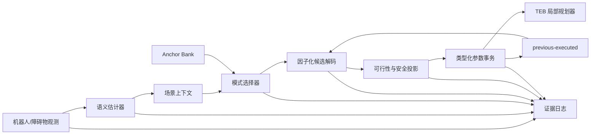

# 第 3 章 FAM-TEB 系统设计

## 3.1 研究问题与设计目标

传统 TEB 局部规划器通过一组连续参数在轨迹时间、障碍物距离、运动学约束和优化稳定性之间取得折中。固定参数在静态或低密度场景中通常足够稳定，但动态交互会同时改变三个条件：障碍物的相对运动、可接受的通过时机，以及局部轨迹优化的可行域。若仅依据瞬时距离连续放大或缩小参数，系统容易把语义判断误差直接放大为控制抖动；若让学习器直接输出任意参数，又难以保证类型、范围、Ackermann 耦合关系和在线执行的一致性。

FAM-TEB 的目标不是替换 TEB 优化器，而是在其外部增加一个可审计的场景感知参数管理层。该层把“识别场景、选择有限模式、生成可行参数、执行事务、记录实际生效值”分离开，使每一步都有明确输入、约束和回退路径。系统设计遵循以下原则：

1. **有限模式优先**：使用离散 Anchor Bank 表达已知且可解释的参数结构，避免无边界的直接参数生成。
2. **场景语义与参数执行解耦**：TTC、交互密度等语义先形成上下文，再由模式选择器映射到参数候选。
3. **可行性先于优化收益**：所有候选在写入前经过类型、上下界、运动学耦合和变化率约束。
4. **实际执行值闭环**：下一时刻平滑和学习状态使用 previous-executed 参数，而不是未必生效的 commanded 参数。
5. **零训练基线可运行**：即使没有 SAC，系统仍能以固定规则和 shadow 模式产生完整决策轨迹。
6. **失败可回退、证据可重放**：参数事务失败时保留原配置，并把命令、可行化、安全投影和实际执行值分别记录。

当前实现只被认定为模拟候选。Anchor Bank 尚未通过性能实验校准，部署阈值均保持 `runtime_ready=false`；本章所述真实车辆接口属于体系边界说明，而不是部署授权。

## 3.2 总体架构

系统由感知语义层、场景上下文层、因子化模式层、可行解码层、执行事务层和证据层构成。其数据流如下。

该结构有两个重要性质。第一，语义错误不会绕过约束直接成为在线参数；它最多改变一个有限模式候选，候选仍需经过可行解码和事务检查。第二，任何性能结果都能回溯到从观测到实际执行值的完整链，而不是只保存学习器输出。

### 3.2.1 输入与输出

语义层的主要输入包括机器人位姿和速度、动态参与者的位姿和速度、参与者几何半径、局部规划状态和时间戳。上下文层进一步构造冲突数量、最小 TTC、交互密度、场景角色和数据有效性标志。系统的最终输出不是速度命令，而是一组满足约束的 TEB 参数事务；速度仍由 TEB 在其轨迹优化过程中生成。

为避免把数据缺失误写成“安全”，每个语义量均携带有效性和来源。无有限 TTC、观测超时、坐标系变换失败和确实无冲突属于不同状态，不应统一编码为零或无穷大后直接进入策略。

## 3.3 动态交互语义

### 3.3.1 相对运动模型

对机器人和第 $i$ 个动态参与者，在短预测窗口内采用局部匀速模型。令

\[
\mathbf{p}_i = \mathbf{p}_{a,i}-\mathbf{p}_r,
\qquad
\mathbf{v}_i = \mathbf{v}_{a,i}-\mathbf{v}_r,
\]

其中下标 $a$ 和 $r$ 分别代表参与者与机器人。若把双方足迹在平面内保守近似为圆，合成接触半径为

\[
R_i = r_r + r_{a,i} + m,
\]

其中 $m\ge 0$ 为可选安全裕度。首次圆接触时间满足

\[
\lVert \mathbf{p}_i+t\mathbf{v}_i\rVert^2 = R_i^2.
\]

展开后得到

\[
a t^2+b t+c=0,
\]

\[
a=\mathbf{v}_i^\top\mathbf{v}_i,
\quad
b=2\mathbf{p}_i^\top\mathbf{v}_i,
\quad
c=\mathbf{p}_i^\top\mathbf{p}_i-R_i^2.
\]

若 $c\le 0$，双方已进入接触边界，定义 TTC 为 0；若相对速度近零或判别式小于 0，则当前匀速模型下没有有限接触时间；否则取最小非负实根

\[
\operatorname{TTC}_i=\min\{t\ge0:at^2+bt+c=0\}.
\]

只有落在预注册预测窗口内的有限根才被标记为 horizon 内冲突。多个参与者存在时，场景级 TTC 取有效候选中的最小值，同时保留参与者级结果和冲突数量，避免一个标量掩盖多冲突结构。

### 3.3.2 circle-contact 与 legacy control

系统保留两种可审计的 TTC 语义实现：

- `circle-contact` 以双方几何接触边界为事件，直接求解首次接触时间；
- `legacy control` 保留历史控制语义，作为配对对照，而不是被新实现覆盖。

两者共用相同的场景、随机种子、调度和评估器，但在语义定义上刻意不同。这样可以区分“场景本身没有冲突”和“语义实现未把该运动关系判为冲突”。I5 的任务是验证这种差异能否在完整执行链中被稳定识别，而不是比较导航性能。

### 3.3.3 三值状态与缺失值纪律

语义输出至少区分：

1. `OBSERVED_CONFLICT`：预测窗口内存在满足定义的冲突；
2. `NO_CONFLICT_IN_HORIZON`：观测有效，但窗口内不存在冲突；
3. 数据不可判定：观测、时间、坐标或资源不满足计算条件。

第三类不能被计入无冲突样本。该设计对论文统计同样重要：缺失观测、运行失败和达到超时上限必须按预注册规则进入结果，而不能被静默删除。

## 3.4 因子化 Anchor Bank

### 3.4.1 有限锚点

Anchor Bank 是一组类型化 TEB 参数配置。每个锚点包含参数名称、数据类型、允许范围、运动学约束以及来源标签。当前锚点属于未校准模拟候选，其价值在于把高维连续动作空间变成有限、可解释、可测试的结构。

设基础模式索引为 $z_b$，场景覆盖模式索引为 $z_o$。系统不为每个组合复制一整套参数，而是采用因子化表示：

\[
\boldsymbol\theta^{\mathrm{cmd}}
=
\mathcal{C}\!\left(
\boldsymbol\theta^{\mathrm{base}}_{z_b},
\Delta\boldsymbol\theta^{\mathrm{overlay}}_{z_o}
\right),
\]

其中 \(\mathcal{C}\) 是带字段所有权和优先级的组合算子。基础模式负责一般运动特性，覆盖模式只修改与当前交互相关的受控字段。这样既减少组合数量，也让论文能够解释某次切换究竟改变了哪些参数。

### 3.4.2 模式选择与滞回

零训练路径使用确定性规则从上下文选择模式。为避免 TTC 在阈值附近产生高频切换，选择器包含：

- 进入阈值与退出阈值分离的滞回；
- 最短驻留时间；
- 观测陈旧时的保守回退；
- 未知场景回到基准锚点；
- 模式切换原因码。

未来学习器若被授权，只能在同一受限候选结构内建议模式或残差，不能绕过解码器、约束和事务层。当前没有新的训练授权，本论文的最后一轮性能设计也固定为零新增训练步数。

## 3.5 可行解码与动作对齐

### 3.5.1 四级动作轨迹

系统把一次决策拆成四个向量：

\[
\boldsymbol\theta^{\mathrm{cmd}}
\rightarrow
\boldsymbol\theta^{\mathrm{feasible}}
\rightarrow
\boldsymbol\theta^{\mathrm{safe}}
\rightarrow
\boldsymbol\theta^{\mathrm{executed}}.
\]

它们分别表示模式选择器提出的值、满足类型和静态约束的值、通过运行时安全投影的值，以及经服务写入并读回后确认的实际值。四者必须分别记录；只保存 commanded 值会把投影率和执行偏差误认为策略行为。

### 3.5.2 类型与范围约束

解码器对浮点、整数和布尔参数使用各自的规范化规则，并拒绝非有限数值、未知字段和隐式类型转换。对每个字段 \(j\)，基本投影为

\[
\theta^{\mathrm{range}}_j
=
\min(\theta^{\max}_j,
\max(\theta^{\min}_j,\theta^{\mathrm{cmd}}_j)).
\]

但逐字段裁剪不足以保证车辆可行性，因此还需检查参数间耦合。例如 Ackermann 运动学相关的转弯半径、角速度和前向速度不能被独立选择；若候选违反耦合约束，解码器按冻结优先级投影或回退，而不是把矛盾值交给动态配置服务。

### 3.5.3 previous-executed 平滑

变化率约束以实际执行值为基准：

\[
\theta^{\mathrm{smooth}}_{j,k}
=
\operatorname{clip}
\left(
\theta^{\mathrm{candidate}}_{j,k},
\theta^{\mathrm{executed}}_{j,k-1}-\Delta_j^{-},
\theta^{\mathrm{executed}}_{j,k-1}+\Delta_j^{+}
\right).
\]

这修复了 commanded 与 executed 不一致时的状态漂移。如果上一次写入失败，下一步仍以真实保留值为基准；如果安全层修改了候选，下一步也不会假设未经执行的原始候选已经生效。

## 3.6 类型化参数事务

一次在线参数更新被建模为有明确边界的事务：

1. 读取并固定目标服务与参数 schema；
2. 验证命令来源、模式身份和运行阶段；
3. 生成 feasible / safe 候选；
4. 调用动态配置服务；
5. 读回并核对类型和值；
6. 成功时提交 `executed` 快照，失败时保留或恢复原配置；
7. 把事务状态、原因码和资源哈希写入证据链。

事务层不把“服务调用返回”当作成功的充分条件；实际读回值才是执行状态。shadow 模式复用相同的上游语义、选择和解码流程，但禁止写服务，只记录假设事务。这使组件开发可在零执行副作用下进行，同时保持与未来执行路径相同的数据结构。

## 3.7 安全边界与故障回退

本系统采用防御性分层，而不是把任何单一阈值称为安全证明：

- 输入层拒绝陈旧、时序倒退或坐标不一致的观测；
- 语义层区分无冲突与不可判定；
- 模式层对未知上下文使用固定回退；
- 解码层执行类型、范围、耦合和变化率约束；
- 事务层要求读回一致，并在失败时保持稳定配置；
- 运行层仍受 TEB 自身可行性和机器人控制链约束；
- 证据层保存失败而不通过重试替换。

这些机制降低了错误传播风险，但不构成形式化无碰撞证明。尤其是匀速 TTC 模型不覆盖参与者突然加速、感知遮挡、足迹非圆形和模型外行为。因此论文应使用“约束”“回退”“完整性检查”等术语，不使用“保证安全”或“消除碰撞”。

## 3.8 实现状态与证据边界

| 子系统 | 当前状态 | 可以说明 | 不能说明 |
|---|---|---|---|
| Anchor Bank 与类型化 profile | 软件/组件门已完成 | 有限候选可加载和校验 | 候选已达到性能最优 |
| 因子化模式与确定性选择 | 已实现零训练路径 | 模式决策可解释、可记录 | 学习策略已收敛 |
| circle-contact TTC | 新鲜模拟集成通过 | 语义状态可在完整链中复现 | 导航性能已提升 |
| feasible decoder | 组件测试和 shadow 链存在 | 类型、范围和耦合可受控 | 所有真实车辆动力学均覆盖 |
| previous-executed 平滑 | 已实现 | 平滑基准与实际生效值对齐 | 已证明优于所有平滑方法 |
| 参数事务 | 模拟集成链通过 | 写入、读回和日志边界可审计 | 已授权真实车辆在线写入 |
| 证据与 assessor | I5 确定性重放通过 | 关键执行资源可复核 | 结果具有统计性能效力 |

## 3.9 待检验的系统假设

本章提出的性能假设是：在保持成功、碰撞和最小间距非劣的前提下，circle-contact 语义减少 semantic-clear 场景中的无效冲突触发，从而降低受限完成时间和不必要的保守行为。该因果链需要同时观察两个层面：

1. **机制层**：无真实冲突场景中的错误冲突触发显著减少；
2. **性能层**：配对完成时间改善，且置信区间排除无改善；
3. **安全层**：成功率、碰撞率、最小间距和真实冲突检测不越过预注册非劣界；
4. **完整性层**：没有替换失败样本、重试挑选或哈希闭包破坏。

I5 只确认了上述机制能够被执行链区分和记录。最终性能结论须由新的 90 个 scene-seed block 配对统计实验决定，不能从六个集成单元外推。

## 3.10 本章小结

FAM-TEB 通过有限 Anchor Bank、场景语义、因子化模式、可行解码、previous-executed 平滑和类型化事务，把自适应参数管理限制在一条可解释、可回退、可审计的路径中。该设计保留 TEB 作为轨迹优化核心，并把学习能力放在受约束的建议层。当前系统已具备组件和新鲜模拟集成证据，但仍是未校准的模拟候选；性能提升、统计泛化和真实车辆部署必须由后续独立证据支持。
