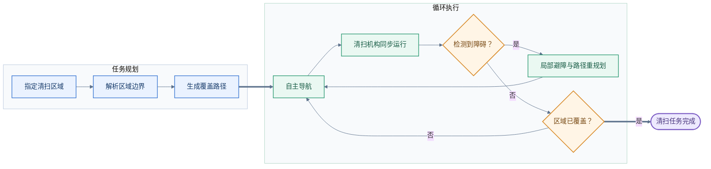
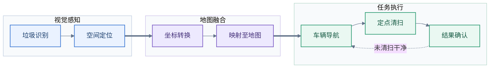
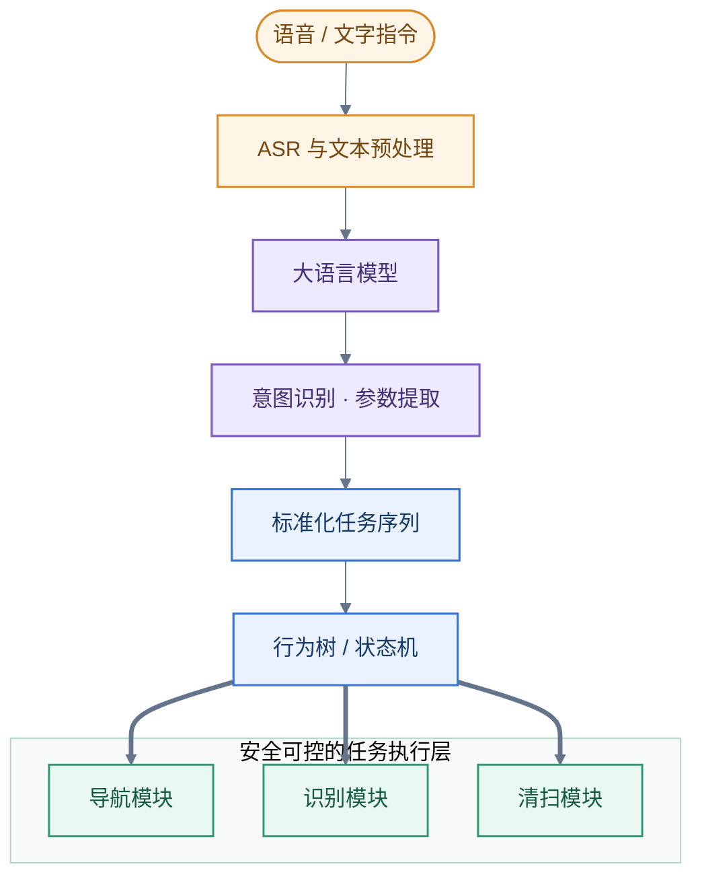
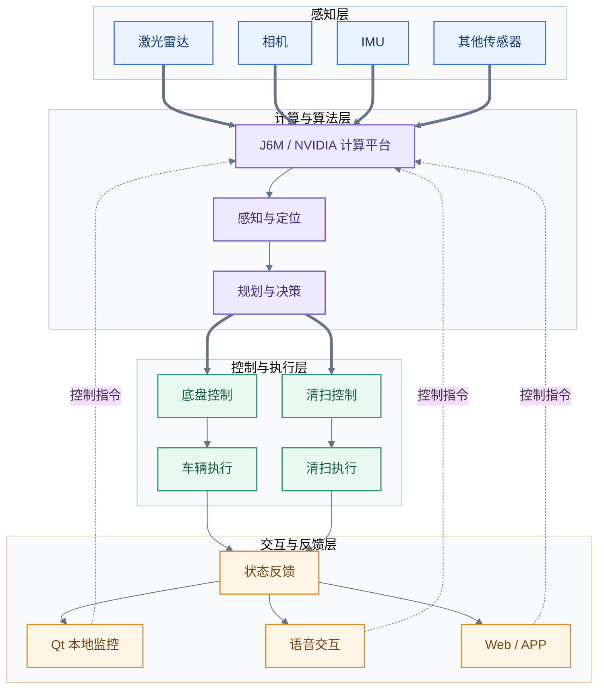
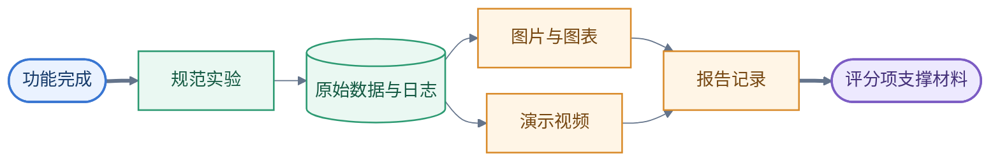
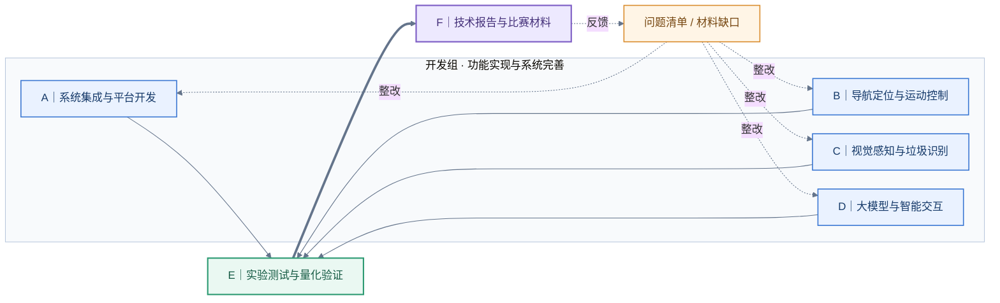
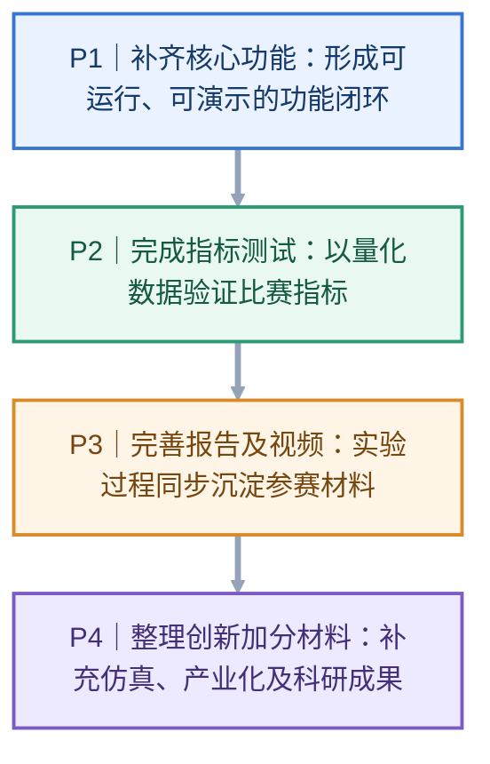
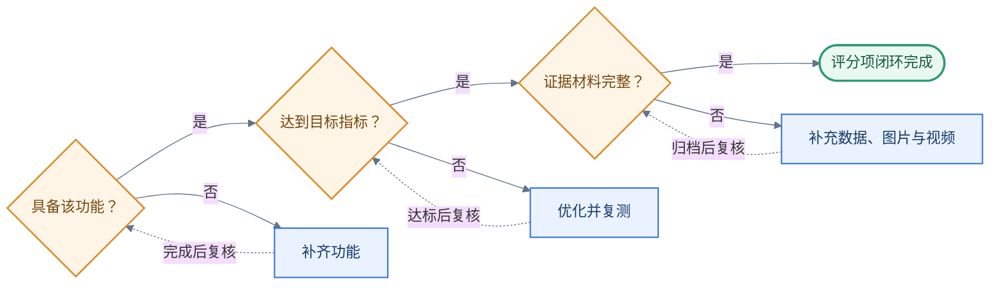

# 无人清扫车“揭榜挂帅”项目交接及后续工作安排

## 一、项目情况及目前进度

本项目参加 2026 年度中国青年科技创新“揭榜挂帅”擂台赛，赛题为**“面向智慧环卫场景的国产系统无人清扫车关键技术攻关”**。

项目依托地平线征程 6 系列计算平台，在现有无人车基础上实现自主建图定位、自主导航、区域覆盖清扫、动态避障、垃圾识别与定位、自动清扫、人机交互及智能任务分解等功能，最终形成完整实物系统、技术报告、测试数据及演示视频。

目前项目已基本完成**平台搭建和核心算法部署**。后续工作重点将由前期开发逐步转向功能闭环、量化验证和参赛材料整理，整体推进路径如下：

### 1. 已完成或基本完成的工作

目前已经完成：

- NVIDIA 主机及地平线 J6M 软硬件环境配置；
- 原机场无人车项目向 J6M 平台迁移；
- NVIDIA 与 J6M 两机通信架构搭建；
- ROS、底盘及主要传感器接入；
- SLAM 建图与定位；
- 自主导航；
- 全局及局部路径规划；
- 基础动态/静态避障；
- YOLO 视觉目标识别；
- 激光雷达、相机、IMU 等传感器部署；
- 底盘控制；
- Qt 基础交互界面；
- 相关视觉/激光 SLAM、多传感器融合、导航规划等技术积累。

团队前期已有的论文、技术报告、实验数据及 IROS 等科研视频，可筛选后作为本项目的技术基础和补充展示材料，但需根据本次无人清扫车项目重新组织。

### 2. 当前主要问题

目前尚需重点解决：

**（1）清扫机构**

清扫装置和防雨外壳仍在加工，完成后需要安装并进行整车联调。后续需确认：

- 清扫宽度；
- 尘箱容量；
- 毛刷及滤网结构；
- 清扫效果；
- 落叶等典型垃圾清扫能力；
- 防雨及轻度积水适应能力；
- 毛刷、滤网快速拆装能力。

同时补充 SolidWorks 工程图、关键尺寸图及实物图片。

**（2）软件稳定性**

目前存在：

- 导航信息偶尔无法正常显示在 Qt；
- 部分网口 IP 重启后发生变化；
- 两机通信和启动流程仍需规范；
- 不同模块启动依赖人工操作；
- 尚未开展长时间连续运行测试。

后续应形成固定 IP、标准启动顺序和统一启动脚本，减少比赛现场人工调试。

**（3）未完全实现的功能**

目前主要缺口包括：

- 全区域覆盖清扫导航；
- 垃圾定点清扫闭环；
- YOLO 识别准确率进一步提升；
- 大语言模型自然语言任务解析；
- 行为树/状态机任务执行；
- 清扫机构与导航控制联动；
- 正式多模态交互功能。

---

## 二、后续重点技术工作

后续原则上不再大规模增加无关算法，而是围绕比赛功能和已有系统进行补齐。

### 1. 区域覆盖清扫

在现有自主导航基础上，形成完整的区域覆盖清扫流程：

重点解决漏扫、重复清扫以及动态障碍情况下的重新规划问题。

### 2. 垃圾识别与定点清扫

YOLO 已经能够运行，后续重点转向识别效果和实际清扫闭环。

补充塑料瓶、纸张、纸盒、塑料袋、落叶、饮料罐等典型垃圾数据，提高模型识别效果。

进一步形成从识别到执行的闭环：

最终垃圾识别不能只停留在显示检测框，而应真正参与车辆决策。

### 3. 大语言模型与智能任务分解

建议采用以下技术路线：

例如：

“先清扫 A 区，然后到 B 区巡检，完成以后返回。”

解析为：

1. 前往 A 区；
2. 开启清扫；
3. 执行 A 区覆盖清扫；
4. 前往 B 区；
5. 执行垃圾巡检；
6. 返回起点。

大模型负责高层任务理解，不直接输出车辆底层控制指令；具体任务由行为树或状态机执行，以保证安全性和稳定性。

### 4. 强化学习及复杂工况

强化学习部分现阶段以**理论方案 + 仿真实验**为主，可结合已有研究和论文成果说明复杂工况下的智能决策方法。

重点补充：

- 状态空间；
- 动作空间；
- 奖励函数；
- 网络及训练方法；
- 仿真环境；
- 收敛结果；
- 典型复杂场景。

最终形成“**传统规划保证可靠性，学习型算法提高复杂环境适应能力**”的混合决策方案。

复杂工况重点考虑：

- ≤1 cm 轻度积水；
- ≤3 cm 落叶堆积；
- 动态人员；
- 突发障碍物；
- 狭窄区域等。

### 5. 系统及人机交互

整个软硬件系统需要整理为统一架构：

明确 J6M 与 NVIDIA 分别运行哪些功能，以及两机之间的数据传输关系。

交互部分建议形成：

- Qt 本地监控；
- 语音/自然语言控制；
- Web/APP 远程控制。

至少保证两种正式交互方式稳定可用。

---

## 三、评分标准及当前完成情况

为便于后续推进，将状态统一划分为：

**已完成 / 待测试 / 待完善 / 开发中 / 未开始。**

| 评分及功能项 | 目标要求 | 当前状态 | 下一步 |
|---|---|---|---|
| 清扫效率 | ≥3500 m²/h | **理论完成，待测试** | 清扫机构安装后开展正式实验 |
| 定位精度 | ≤50 mm | **理论完成，待测试** | 与高精度参考轨迹进行定量比较 |
| 建图面积 | ≥20,000 m² | **理论完成，待测试** | 完成机场/校园大面积建图 |
| 避障成功率 | ≥95% | **理论完成，待测试** | 多场景、多次重复实验 |
| 紧急制动 | ≤1 s | **理论完成，待测试** | 日志及视频测试响应时间 |
| 垃圾识别 | ≥95% | **待完善** | 数据集扩充、模型优化及独立测试 |
| 智能任务分解 | 按高标准达到≥95% | **开发中** | 完成 LLM、标准任务和行为树 |
| 区域覆盖清扫 | 完成区域自主清扫 | **开发中** | 补充覆盖规划及清扫联动 |
| 垃圾定点清扫 | 识别、定位、导航、清扫闭环 | **理论完成，待测试** | 打通视觉与导航接口 |
| 强化学习/智能决策 | 体现算法先进性 | **待完善** | 完成方案、仿真及结果 |
| 复杂工况 | 积水、落叶等 | **开发中** | 完善机械和控制策略并验证 |
| 尘箱容量 | ≥40 L | **开发中** | 机械完成后实际测量 |
| 清扫宽度 | ≥600 mm | **已完成** | 工程图及实物测量 |
| 多学科融合 | 自动驾驶、机器人、AI等 | **已完成** | 报告中系统化总结 |
| 多模态交互 | 至少两种 | **开发中** | 语音 + Web/APP，Qt辅助 |
| 新用户学习成本 | 3天内掌握 | **待完善** | 编写用户操作说明并试用 |
| 运维便捷性 | 易损件≤3步更换 | **理论完成，待测试** | 毛刷、滤网实际拆装测试 |
| 系统可靠性 | 日均故障率<1% | **理论完成，待测试** | 长时间连续运行 |
| 系统完整性 | 功能完整稳定 | **开发中** | 最终整车联调 |
| 技术报告 | 内容完整、数据详实 | **开发中** | 开发与测试同步更新 |
| 演示视频 | 5–10分钟完整展示 | **未开始正式制作** | 实验过程中同步录制 |
| 产业化及社会效益 | 应用价值及加分材料 | **未开始系统整理** | 补充机场、校园、园区应用分析 |
| 论文/专利等成果 | 加分支撑 | **已完成** | 筛选与项目相关成果 |

目前项目最明显的特点是：

> **核心技术基础已经比较完整，当前最大的缺口不是“有没有功能”，而是“能否形成比赛认可的量化测试结果”。**

因此，后续每完成一个功能，都应同步形成完整证据链，避免在项目后期集中补充测试材料：

---

## 四、实验、报告及演示材料安排

由于目前项目整体进度较靠前，后续实验测试和报告材料的工作量会明显增加，因此安排两名成员专门负责相关工作。

### 1. 实验测试

正式实验主要包括：

- 定位精度；
- 大面积建图；
- 动态/静态避障；
- 紧急制动；
- YOLO 垃圾识别；
- 大模型任务解析；
- 清扫效率；
- 清扫效果；
- 清扫宽度；
- 尘箱容量；
- 积水和落叶复杂工况；
- 毛刷、滤网拆装；
- 长时间连续运行稳定性。

每项正式实验应采用统一记录模板，至少包含以下信息：

| 信息类别 | 记录内容 |
|---|---|
| 基本信息 | 实验日期、地点、环境、实验人员 |
| 系统配置 | 软件版本、车辆配置、关键参数 |
| 过程记录 | 测试次数、成功次数、异常情况 |
| 结果材料 | 原始数据、统计结果、图片/图表、视频编号 |

例如避障实验不能只写“能够成功避障”，而应形成类似：

> 共进行 50 次动态避障实验，成功 49 次，避障成功率为 98%。

定位实验应给出：

- 估计轨迹；
- 参考轨迹；
- RMSE；
- 平均误差；
- 最大误差；
- 误差曲线。

YOLO 实验应给出：

- Precision；
- Recall；
- F1；
- mAP；
- 不同垃圾类别结果。

### 2. 技术报告

技术报告内容建议压缩为六个主要章节：

1. **项目背景及需求分析**  
   智慧环卫、机场/校园/园区需求、研究现状、竞品及行业痛点。

2. **系统总体架构与技术路线**  
   硬件、软件、通信、算法、人机交互及完整工作流程。

3. **关键技术**  
   SLAM、多传感器定位、YOLO、垃圾定位、导航规划、区域覆盖、动态避障、大语言模型、行为树、强化学习、清扫机构及 J6M 部署。

4. **项目创新点**  
   国产平台全栈系统、大模型任务执行、学习型智能决策、垃圾定点清扫闭环、模块化清扫机构等。

5. **实验测试与结果**  
   按比赛评分项逐项给出测试流程、数据、图表和结论。

6. **应用价值与总结**  
   机场、校园、园区等应用场景，用户体验、运维、可靠性、产业化及后续发展。

### 3. 演示视频

正式实验过程中同步拍摄，避免后期重新做大量演示。

视频建议重点展示：

- 整车及硬件；
- J6M/NVIDIA；
- Qt/RViz/地图界面；
- 建图与定位；
- 自主导航；
- 动态避障；
- YOLO 垃圾识别；
- 大语言模型语音任务；
- 区域覆盖清扫；
- 清扫前后对比；
- 机场、校园、室内/半室内场景；
- 关键实验指标。

可以采用**实车画面 + 软件界面双屏**形式，并增加简短文字、轨迹图和测试数据。

已有科研视频中与本项目直接相关的内容可以作为补充素材。

---

## 五、项目分工

六人分工采用“**4 人负责开发和系统完善 + 2 人负责实验及参赛材料**”的组织方式。

每个人的任务尽量保持属性一致，避免开发、测试、材料相互混杂。

| 成员 | 角色 | 主要任务 |
|---|---|---|
| **lyq/lyf/ghy** | **系统集成与平台开发负责人** | J6M/NVIDIA、ROS、两机通信、固定IP、Qt、传感器和底盘接口、清扫机构接入、系统联调、启动脚本及软件稳定性 |
| **lyq/lyf/ghy** | **导航定位与运动控制负责人** | SLAM、定位、自主导航、全局/局部规划、区域覆盖规划、动态避障、定点导航、急停及运动控制 |
| **zxy/ghy/djh/cws** | **视觉感知与垃圾识别负责人** | YOLO、垃圾数据集、模型训练优化、相机及相关传感器、垃圾识别、垃圾三维/地图定位 |
| **lyf/zxy** | **大模型与智能交互负责人** | ASR、大语言模型、任务解析、结构化任务、行为树/状态机、语音控制、Web/APP交互及强化学习仿真相关工作 |
| **hzy/zxy/all** | **实验测试与数据分析负责人** | 根据评分标准制定实验方案，组织定位、建图、避障、清扫、YOLO、LLM、稳定性等测试，负责原始记录、数据统计、图表和测试报告 |
| **hzy/zxy/djh/cws** | **技术报告与比赛材料负责人** | 比赛需求拆解、技术报告、评分表跟踪、用户说明书、系统架构图、创新点整理、视频脚本、素材管理及最终提交材料 |
| **lyq/ghy/lyf** | **机械结构、硬件设备与现场保障负责人等** | 负责机械设计、三维建模、清扫装置安装调试、性能验证及设备维保，负责设备、网络、供电和软件环境保障，以及现场故障排查 |
| **djh/cws** | **硬软件设备支持** | 负责设备租借与归还、使用登记、设备问题上报、故障协调处理及软硬件环境保障 |
| **zjr/gm/zzn** | **科研成果与材料支持** | 负责论文、专利及科研成果整理，创新点提炼和报告审校 |

### 协作关系

开发人员负责实现和完善功能，E、F 负责将技术成果转化为可用于比赛验收的量化证据和参赛材料。具体协作关系如下：

例如定位精度：

- B 负责定位算法；
- E 负责设计并完成正式测试；
- F 将实验流程、轨迹和误差结果写入报告。

垃圾识别：

- C 负责模型；
- E 负责正式测试和统计；
- F 负责整理成图表和报告内容。

大模型：

- D 负责开发；
- E 建立标准测试集并计算任务解析准确率；
- F 整理系统流程和实验结果。

原则上**一个任务设置一个第一负责人**，其他成员作为协作人员，避免出现责任不明确的问题。

---

## 六、近期工作及推进原则

### 1. 近期优先工作

当前工作按照“先形成核心闭环，再完成量化验证，最后完善展示与加分材料”的顺序推进：

#### 总体时间节点

为确保作品于 **2026 年 9 月 15 日前提交**，各阶段按以下时间节点推进：

| 阶段 | 主要目标 | 完成时间 |
|---|---|---|
| **阶段一：系统完善** | 补齐核心功能，完成系统联调，形成可运行、可演示的功能闭环 | **8 月 25 日前** |
| **阶段二：验证优化** | 集中完成指标测试、问题整改及稳定性优化 | **8 月 30 日前** |
| **阶段三：成果交付** | 完成报告、视频及参赛材料整理，形成完整提交版本 | **9 月 7 日前** |
| **最终提交** | 完成材料复核、查漏补缺及作品提交 | **9 月 15 日前** |

#### 第一优先级：补齐核心功能

- 清扫机构安装；
- 区域覆盖清扫；
- YOLO 优化；
- 垃圾定位；
- 大模型任务解析；
- 行为树；
- 多模态交互；
- Qt/IP 等系统 Bug。

#### 第二优先级：集中完成比赛指标测试

- 定位精度；
- 建图面积；
- 避障成功率；
- 紧急制动；
- 清扫效率；
- YOLO；
- LLM；
- 复杂工况；
- 运维；
- 长时间可靠性。

#### 第三优先级：报告及视频

正式实验过程中同步整理：

- 原始数据；
- 日志；
- 图片；
- 视频；
- 实验表格；
- 技术报告。

#### 第四优先级：创新及加分材料

包括：

- 强化学习仿真；
- 产业化方案；
- 用户体验；
- 成本分析；
- 相关论文、专利及科研成果。

### 2. 每名成员近期计划

六名成员根据自己的分工分别整理一份简短工作计划，统一回答：

1. 当前已经完成什么；
2. 目前存在什么问题；
3. 接下来准备完成什么；
4. 预计形成哪些结果；
5. 需要其他成员或老师提供什么支持。

整理后统一向魏老师汇报。

### 3. 项目资料管理

后续正式开发和实验建议统一保存：

- 代码版本；
- 参数文件；
- rosbag/运行日志；
- 实验数据；
- 实验表格；
- 图片；
- 原始视频；
- 剪辑视频；
- SolidWorks 图纸；
- 报告版本。

每项实验建立统一编号，便于后期直接追溯和整理。

团队成员可根据需要到教研室集中开发和调试，减少设备分散及沟通成本。同时可继续体验 HSD 和地平线相关工具，后续若学校举办相关开发者大会，可将本项目作为完整案例进行展示。

---

总体而言，目前项目基础开发已经较为完整，下一阶段不应单纯追求增加更多算法，而应重点做好：

> **补齐关键功能、解决系统稳定性问题、把已有功能真正测出来，并通过实验数据、技术报告和视频把项目完整展示出来。**

最终目标是使每一个比赛评分项都能明确回答以下三个问题：

